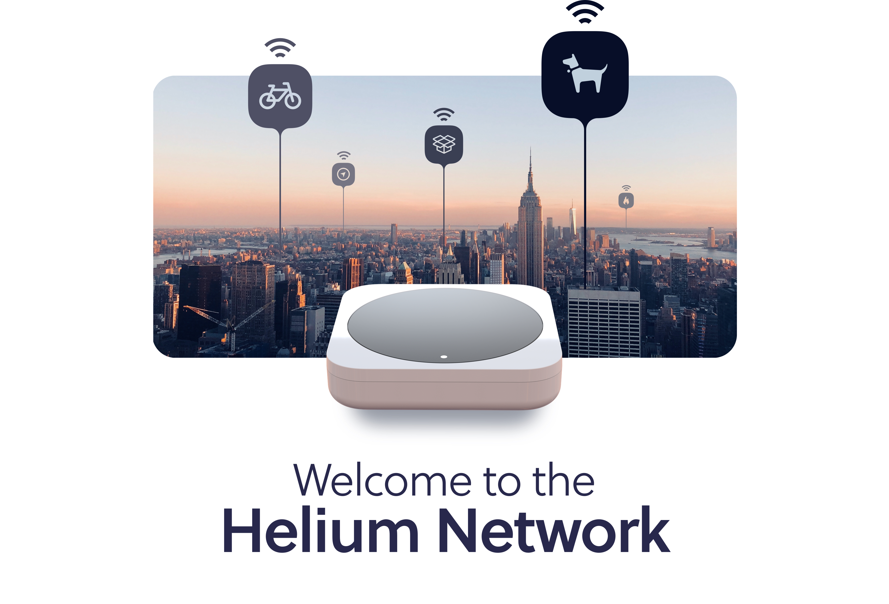

# Home

### Welcome to the Helium network

The Helium network enables long range, low power, bi-directional communication for LoRaWAN compatible devices.

The Helium network is open, permissionless, and requires no up-front payments, contracts or commitments to use. Devices pay Hotspot owners on a per-packet basis using Data Credits for packets that are delivered to the appropriate network server.

In this developer documentation you will find examples, tutorials, specifications, and API references for building devices to run on the Helium network.

##  Console

Learn how to communicate with your devices on the network. [Read about Console](console/introduction.md)

##  Devices

Learn how to make your devices communicate on the network. [Read about Devices](devices/introduction.md)

##  Blockchain

Learn more about the blockchain that powers the network. [Read about the Blockchain](blockchain/introduction.md)

##  Hotspot

Learn more about the hotspot that provides the network. [Read about the Hotspot](hotspot/introduction.md)

##  LongFi

The LongFi architecture combines the Helium blockchain with the LoRaWAN wireless protocol. [Read more about LongFi](longfi/introduction.md)

