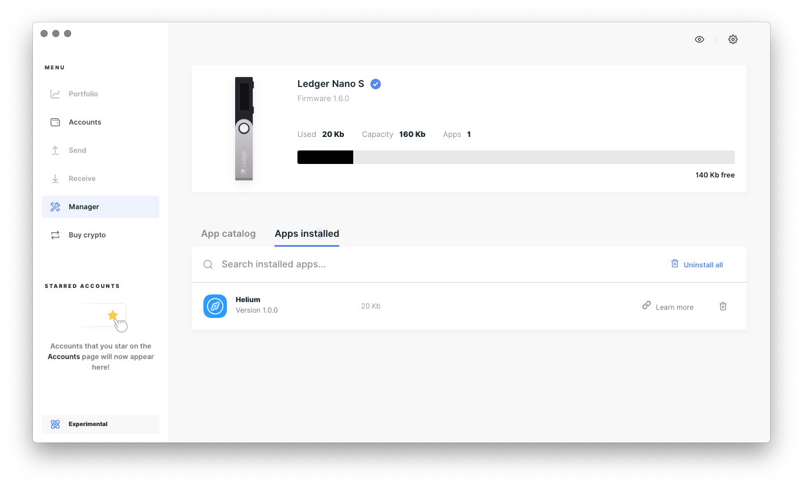
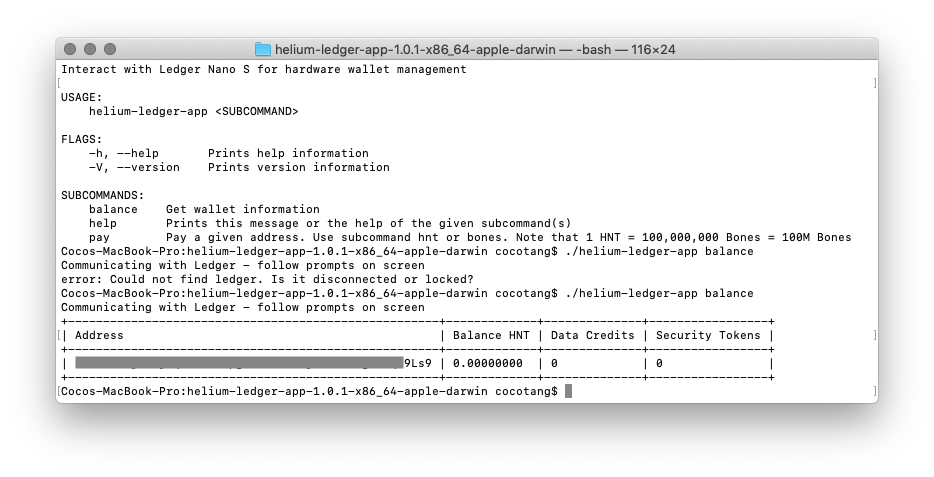
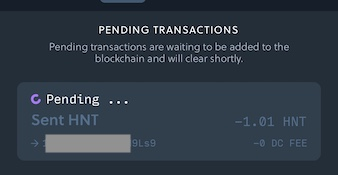
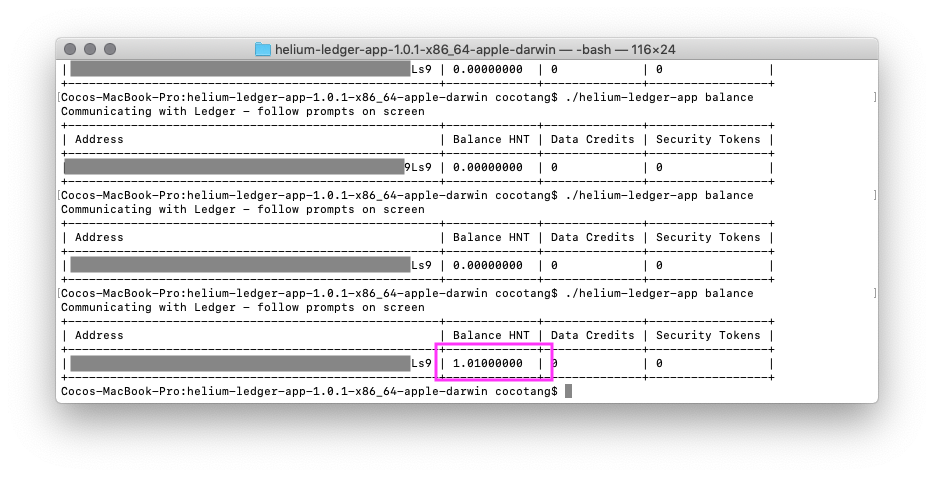

# Ledger Hardware Wallet

The Helium blockchain has support for Ledger hardware wallets. When installed on a Nano S, the Helium ledger app allows you to view your Helium address, check your balance, and submit transactions while using the companion app.

This guide will walk through using Helium on a Ledger Nano S.

## Installing the Helium ledger application

* Go to Ledger Live &gt; Settings &gt; Experimental Features &gt; Enable Developer mode. 

* Once enabled, go to Manager and search "Helium".
* Note: If you can't find "Helium", you may need to update your Ledger Live software version and/or the Nano S software
* Click Install. 

The Helium App has been signed by Ledger and is trusted. It is now installed on your ledger device!

Start the Helium app by selecting it on the Ledger screen. The "Waiting for commands..." prompt should be on the screen. execute commands.

To interact with the app on Ledger, you will need to use the CLI. Head to Releases in this Github repo and download the file for your operating system.

We'll use macOS for the remainder of this example -

* Download the release for macOS `helium-ledger-app-x.x.x-x86_64-apple-darwin.zip` and unzip the file
* Navigate to where you downloaded the release on your computer in terminal
* Make sure your ledger is connected to your computer, then type `./helium-ledger-app` 

* type `./helium-ledger-app balance` to see your new Ledger address and balance

## Receiving HNT

1. On your Helium mobile app, tap `Send HNT` and paste your ledger address. Enter any amount to send. This example will send 1.01 HNT.
2. You should see a pending transaction in the mobile app.
3. Go back to `helium-ledger-app` and type `./helium-ledger-app balance`. The balance will update once the transaction has cleared.

## Sending HNT

1. On the CLI, type `./helium-ledger-app pay <address> hnt <amount>` to pay in HNT. Press `return`.
2. On the Ledger, follow the prompts and confirm the transaction.
3. The CLI should show a confirmation of the transaction.

## Common Issues

#### Can't download the zip file because it is untrusted.

1. In the downloads bar of your browser, click the caret and select `Keep`. 

#### Running commands in terminal does not work. MacOS users may need to update their security permissions.

1. Go to System Preferences &gt; Security & Privacy
2. Allow App downloaded from App Store and Identified Developers
3. You may need to click the lock icon and give the CLI permissions
4. Run the command in CLI again

#### Failed opening hid device

If you see this error `error: hid error: Failed opening hid device`, close Ledger Live software and run a command again in the CLI.

#### Unable to access memory outside buffer bounds

If on Ledger Live you see this error, unplug the ledger from your computer and plug it in again.

## Security Model

The attack surface for using the Helium wallet app on a Ledger Nano S comprises the Helium app itself, the system firmware running on the Nano S, the computer that the Nano S is connected to, and posession/control of the device. For our purposes, the app only needs to ensure its own correctness and protect the user from the computer that the Nano S is connected to. Other attack surfaces are beyond our control; we assume that the user physically controls the device, is not running malicious/buggy software on the device, and follows proper security protocols. The goal of the Helium app is to achieve perfect security given these assumptions.

The main attack vector that we are concerned with, then, is a computer running malicious sofware. This software may imitate programs like `helium-ledger-app` in such a way that the user cannot tell the difference, but secretly act maliciously. Specifically, the computer can do the following:

1. Lie to the user about which actions it is performing. 

   Example: the user runs `./helium-ledger-app balance` to display their public key to so that they may receive payment; yet a hard-coded address is displayed

2. Lie to the user about who the recipient is. 

   Example: the user runs `./helium-ledger-app pay IntendedAddress amount`, yeet the program again uses a hard-coded address

To combat these attacks, apps must make use of the embedded display on the Nano S. If data sent to/from the Nano S is displayed on the screen, the user can verify that the computer is not lying about what it sent or received. In the interest of user-friendliness, we would like to display as little information as much as possible, but each omission brings with it the risk of introducing a vulnerability. Therefore, an app should display all data by default, and omit data only after subjecting the omission to extreme scrutiny. The Sia app adheres to this principle more closely than most Ledger apps, and as a result is not affected by certain vulnerabilities affecting those apps.

