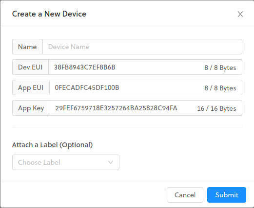

# Adding Devices

To add a device, go to **Devices** and click the **+ Add Device** icon on the top right of the window.

Enter a name for your device. Device names do not have to be unique \(as every device will be given a unique identifier generated by Console\). `DevEUI`, `AppEUI`, and `AppKey` are auto generated by the Helium Console when you create a new device. However, you can input your own `DevEUI`, `AppEUI`, and `AppKey` if your device is already provisioned with these credentials.

* **Device EUI** - 64 bit end-device identifier, sometimes called Manufacturer EUI
* **App EUI** - 64 bit application identifier
* **App Key** - 128 bit AES key, used to secure communication between device and network

Once added, you'll see a consolidated view of all your device details, as well as the Activation Method \(only `OTAA` is currently supported\) and the LoRaWAN US Channels used by the Helium Network \(which will always be `sub-band 7`\).

#### Important Information When Adding Devices

### Is The Helium Network a Public or Private LoRaWAN?

The Helium Network is a Public LoRaWAN Network.

### Delay After Adding Device

LoRaWAN devices may behave differently from one manufacturer to another. After adding a new device, it may take some time to join the network and begin receiving data. This can range from less than a minute to as long as several minutes. If your device does not try all 8 sub-bands, then you will need to ensure it is trying to communicate on the correct sub-band, which is sub-band 7.

### MSB vs LSB, Using the Correct Endianness

When copying EUIs and Keys into your device software, or into Console, make sure you are using the correct byte ordering, known as "endianness". This is often labeled as `MSB` \(Most Significant Bit\) and `LSB` \(Least Significant Bit\). Reversing byte order is a very common mistake when adding a new device to the network. On the device details page in Console, you can easily switch the byte order of the EUIs and Key by cliking the `lsb` or `msb` label next to them.

