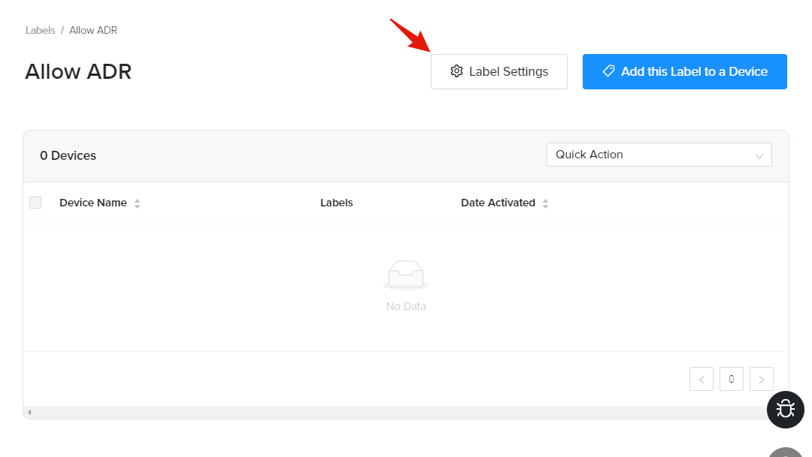
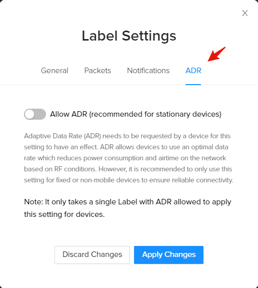

# ADR

Adaptive Data Rate or ADR is a mechanism for adapting the data rate of devices in a LoRaWAN network.  This allows a device's airtime and power consumption to be optimized by the Network Server. Learn more about ADR from Semtech's developer portal [here](https://lora-developers.semtech.com/library/tech-papers-and-guides/understanding-adr/).


* ADR will only work if your device requests ADR. 
* Using ADR is only suggested for devices that are static for long periods of times. ADR is not suggested for devices that are constantly changing location or have unstable RF conditions.


### ADR Algorithm

The network server behind Console implements a specific algorithm for determining the optimal data rate and transmit power to send down to the device. ADR only increases the device's data rate, but it increases or decreases transmit power as needed. The network only calculates data-rate/power corrections after it collects 20 contiguous uplink packets with the ADR bit set to 1. From this point on, the network _may_ send downlink `LinkADRReq` MAC commands, either alone or with already-scheduled downlink packets. The network server clears its ADR history whenever a device sends an uplink packet with ADR set to 0.

### Allowing ADR in Console

ADR is managed via Label settings in Console. To allow ADR for one device or a group of devices, simply toggle the _Allow ADR_ in your Label settings. You can either create a Label strictly for managing ADR, or adjust the setting on a Label you already have attached to your devices. To change the settings for a label, navigate to the Label management page and click _Label Settings_ as shown below.

Next you will be presented with the Label settings window show below, click the ADR tab.

Here you can toggle the _Allow ADR_ setting and apply the changes to the Label settings. Last, if you don't already have the Label attached to your device or devices then you will need to do that before these setting are applied.

