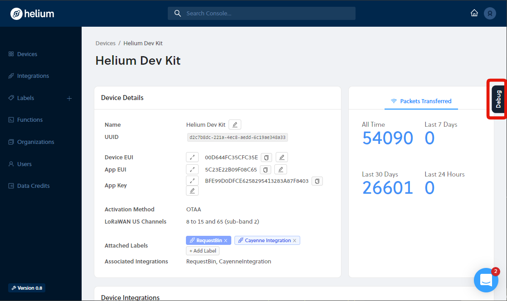
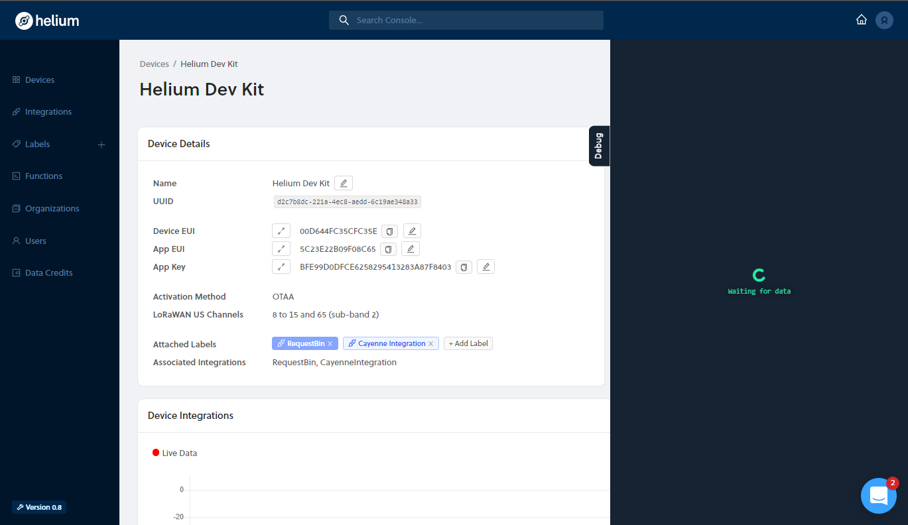
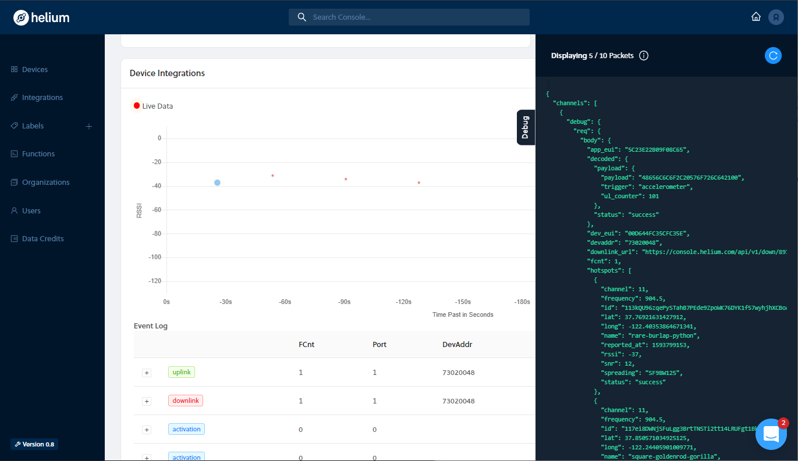

# Debug

The Console Debug tool allows you to quickly and easily examine device messages. This enables you to verify and debug issues much more easily without requiring the data to be sent to an application endpoint first.  For security reasons the Debug tool does not persist data, instead the ten most recent messages are accumulated from the time the Debug window is opened. 

### Using The Debug Tool

The Debug tool is located on the upper right side of every device page, see the image below. To access it, just click the Debug tab and a window will pop out. 



At first you will see a spinning wheel and the message _Waiting for data,_ this is because the debug tool only shows packets that come through while the window is open, see below.



Once packets are received or sent down to your device, you will see them display immediately in the Debug window, see below.



### Debug Packet Types

The Debug tool will display a message for every uplink or downlink. For detailed information on the contents of the messages please see the [JSON schema documentation](integrations/json-schema.md).


Payloads shown in the debug messages are base64 encoded, just as the JSON messages received by integrations. You will need to decode the payload strings in order to correctly interpret the payload data.


#### Activation

When your device first joins the network, you will see a special uplink message just for the activation, which will not have a payload, as shown below, and only includes a single hotspot. 

```text
{
  "channels": [],
  "devaddr": null,
  "device_name": "Helium Dev Kit",
  "frame_down": 0,
  "frame_up": 1,
  "hotspots": [
    {
      "frequency": 903.9000244140625,
      "id": "11D86CyMMt685XcsddPtaChWr3qz2UxDyhGG5EUeZbwqemxjBMb",
      "name": "fancy-rusty-toad",
      "rssi": -35,
      "snr": 11.5,
      "spreading": "SF10BW125"
    }
  ],
  "id": "2091f225-4b7c-4524-a2c1-5f41fb429099",
  "payload": null,
  "payload_size": 0,
  "port": 0
}
```

#### Uplink

For uplink packets, a message similar to the one below will be shown. In addition to the original uplink message data, which starts at the very bottom, this message types will also show a message for each integration attached to the device, so that you can examine what is being sent to those enpoints. For the message shown below, you can see there is a message for the RequestBin and Cayenne Integrations I have attached to this device. You can differentiate uplink messages by keeping track of the _frame\_up_ count.

```text
{
  "channels": [
    {
      "debug": {
        "req": {
          "body": {
            "app_eui": "5C23E22B09F08C65",
            "dev_eui": "00D644FC35CFC35E",
            "devaddr": "94020048",
            "downlink_url": "https://console.helium.com/api/v1/down/a22f600d-8453-4eac-912d-83f713f1df2b//d2c7b8dc-221a-4ec8-aedd-6c19ae348a33",
            "fcnt": 1,
            "hotspots": [
              {
                "channel": 10,
                "frequency": 904.2999877929688,
                "id": "113kQU96zqePySTahB7PEde9ZpoWK76DYK1f57wyhjhXCBoAu88",
                "lat": 37.76921631427912,
                "long": -122.40353864671341,
                "name": "rare-burlap-python",
                "reported_at": 1593801826,
                "rssi": -46,
                "snr": 9.800000190734863,
                "spreading": "SF9BW125",
                "status": "success"
              },
              {
                "channel": 10,
                "frequency": 904.2999877929688,
                "id": "117ei8DWNjSFuLgg3BrtTNSTi2tt14LRUFgt1Bk2kYqkHWrg82c",
                "lat": 37.850571034925125,
                "long": -122.24405901009771,
                "name": "square-goldenrod-gorilla",
                "reported_at": 1593801826,
                "rssi": -73,
                "snr": 10,
                "spreading": "SF9BW125",
                "status": "success"
              }
            ],
            "id": "d2c7b8dc-221a-4ec8-aedd-6c19ae348a33",
            "metadata": {
              "labels": [
                {
                  "id": "153baa5c-9bbe-4afb-bab4-a13358f2638d",
                  "name": "RequestBin",
                  "organization_id": "ef7c0454-177f-4ef3-aaab-d2a9ba6e9d15"
                },
                {
                  "id": "fe5d41e4-82e6-4ea5-8e6e-e94aed3de79a",
                  "name": "Cayenne Integration",
                  "organization_id": "ef7c0454-177f-4ef3-aaab-d2a9ba6e9d15"
                }
              ]
            },
            "name": "Helium Dev Kit",
            "payload": "SGVsbG8sIFdvcmxkIQA=",
            "port": 1,
            "reported_at": 1593801826
          },
          "headers": {
            "Content-Type": "application/json"
          },
          "method": "post",
          "url": "https://lora.mydevices.com/v1/networks/helium/uplink"
        },
        "res": {
          "body": "",
          "code": 200,
          "headers": {
            "Connection": "keep-alive",
            "Content-Length": "0",
            "Date": "Fri, 03 Jul 2020 18:43:47 GMT",
            "cache-control": "no-cache",
            "vary": "origin"
          }
        }
      },
      "description": "Connection established",
      "id": "a22f600d-8453-4eac-912d-83f713f1df2b",
      "name": "CayenneIntegration",
      "status": "success"
    },
    {
      "debug": {
        "req": {
          "body": {
            "app_eui": "5C23E22B09F08C65",
            "dev_eui": "00D644FC35CFC35E",
            "devaddr": "94020048",
            "downlink_url": "https://console.helium.com/api/v1/down/897780bc-6980-42c1-a659-30077e8dbcd1/h4IxFDle6biV1ZKmrUJamaXhKjRRF3c-/d2c7b8dc-221a-4ec8-aedd-6c19ae348a33",
            "fcnt": 1,
            "hotspots": [
              {
                "channel": 10,
                "frequency": 904.2999877929688,
                "id": "113kQU96zqePySTahB7PEde9ZpoWK76DYK1f57wyhjhXCBoAu88",
                "lat": 37.76921631427912,
                "long": -122.40353864671341,
                "name": "rare-burlap-python",
                "reported_at": 1593801826,
                "rssi": -46,
                "snr": 9.800000190734863,
                "spreading": "SF9BW125",
                "status": "success"
              },
              {
                "channel": 10,
                "frequency": 904.2999877929688,
                "id": "117ei8DWNjSFuLgg3BrtTNSTi2tt14LRUFgt1Bk2kYqkHWrg82c",
                "lat": 37.850571034925125,
                "long": -122.24405901009771,
                "name": "square-goldenrod-gorilla",
                "reported_at": 1593801826,
                "rssi": -73,
                "snr": 10,
                "spreading": "SF9BW125",
                "status": "success"
              }
            ],
            "id": "d2c7b8dc-221a-4ec8-aedd-6c19ae348a33",
            "metadata": {
              "labels": [
                {
                  "id": "153baa5c-9bbe-4afb-bab4-a13358f2638d",
                  "name": "RequestBin",
                  "organization_id": "ef7c0454-177f-4ef3-aaab-d2a9ba6e9d15"
                },
                {
                  "id": "fe5d41e4-82e6-4ea5-8e6e-e94aed3de79a",
                  "name": "Cayenne Integration",
                  "organization_id": "ef7c0454-177f-4ef3-aaab-d2a9ba6e9d15"
                }
              ]
            },
            "name": "Helium Dev Kit",
            "payload": "SGVsbG8sIFdvcmxkIQA=",
            "port": 1,
            "reported_at": 1593801826
          },
          "headers": {
            "Content-Type": "application/json"
          },
          "method": "post",
          "url": "https://enyfenof1pbel.x.pipedream.net/"
        },
        "res": {
          "body": {
            "success": true
          },
          "code": 200,
          "headers": {
            "Access-Control-Allow-Origin": "*",
            "Connection": "keep-alive",
            "Content-Length": "16",
            "Content-Type": "application/json; charset=utf-8",
            "Date": "Fri, 03 Jul 2020 18:43:47 GMT",
            "X-Powered-By": "Express",
            "x-pd-status": "sent to primary"
          }
        }
      },
      "description": "{\"success\":true}",
      "id": "897780bc-6980-42c1-a659-30077e8dbcd1",
      "name": "RequestBin",
      "status": "success"
    }
  ],
  "devaddr": "94020048",
  "device_name": "Helium Dev Kit",
  "frame_down": 1,
  "frame_up": 1,
  "hotspots": [
    {
      "frequency": 904.2999877929688,
      "id": "113kQU96zqePySTahB7PEde9ZpoWK76DYK1f57wyhjhXCBoAu88",
      "name": "rare-burlap-python",
      "rssi": -46,
      "snr": 9.800000190734863,
      "spreading": "SF9BW125"
    },
    {
      "frequency": 904.2999877929688,
      "id": "117ei8DWNjSFuLgg3BrtTNSTi2tt14LRUFgt1Bk2kYqkHWrg82c",
      "name": "square-goldenrod-gorilla",
      "rssi": -73,
      "snr": 10,
      "spreading": "SF9BW125"
    }
  ],
  "id": "3d62df26-a153-406c-ab85-028a5107d681",
  "payload": "SGVsbG8sIFdvcmxkIQA=",
  "payload_size": 14,
  "port": 1
}
```

#### Downlink / ACK

Downlink and ACK messages will only show a single hotspot, similar to the activation message. You can differentiate downlink messages by keeping track of the _frame\_down_ count.

```text
{
  "channels": [],
  "devaddr": null,
  "device_name": "Helium Dev Kit",
  "frame_down": 2,
  "frame_up": 1,
  "hotspots": [
    {
      "frequency": 903.9000244140625,
      "id": "11D86CyMMt685XcsddPtaChWr3qz2UxDyhGG5EUeZbwqemxjBMb",
      "name": "fancy-rusty-toad",
      "rssi": -35,
      "snr": 11.5,
      "spreading": "SF10BW125"
    }
  ],
  "id": "2091f225-4b7c-4524-a2c1-5f41fb429099",
  "payload": null,
  "payload_size": 0,
  "port": 0
}
```

