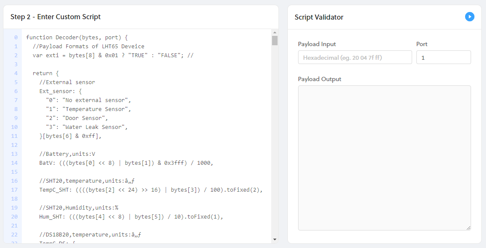

# Functions

You can now execute functions on Console! With the Decoder Function, users can transform and/or parse a raw payload before it is posted to an endpoint. 

When a Decoder Function is applied to a device or integration via a Label, the Decoder Function code is executed on the payload sent by the device. The Decoder Function can be written using custom JavaScript code provided by the user or selected from prebuilt decoders \(currently Browan Object Locator and Cayenne LPP\).

Console decoders are compatible with The Things Network \(TTN\) decoders, which are already available for a wide variety of devices.

## A Primer on Encoding and Decoding

LoRaWAN networks are, by design, low bandwidth. This means that we must make the very most out of every byte that we send over the air. This also means that we shouldn't send inefficient types like characters and strings. For example, to represent a single English letter with the widely used ASCII encoding standard, you have to use an entire byte. This makes sense if your data can only be stored as English words, but in the case of IoT devices, there is often only the need to store numeric values.  For every transmission, we want to pack as much information into as few bytes as possible. Because of this, there are special encoding standards specifically made for sending common IoT device data such as [CayenneLPP](https://developers.mydevices.com/cayenne/docs/lora/#lora-cayenne-low-power-payload). 

These types of standards allow you to easily encode your data much more efficiently. Once your data has been received over the air by the network, there is no longer the necessity of encoding the data with a standard that can make it more challenging for humans to interpret. This is where Function Decoders come in, they allow you to decode your device data so that you can interpret it for debugging issues or translate it before sending it to your application or another service.

## Creating a Function Decoder


**Decoder Library on GitHub**

If you have purchased an off-the-shelf device, it is likely that there already exists a decoder you can use! We have a [repository ](https://github.com/helium/console-decoders)that contains decoders for a number of popular devices.


To begin creating a new function within the Helium Console, select Functions from the left side navigation. Then create a new Function by clicking on the `Create New Function` button in the upper-right.

Name your new Function, select "Decoder" as Function Type, and "Custom Script" as Format if you want to enter your own script, or select from the predefined decoders.

Next we need to enter the JavaScript that will decode our payloads for us. The Script Validator allows you to easily test inputs in hexadecimal form to ensure that your script will run successfully.

### Attaching Labels to Functions

  
Once we have entered our decoder script, the last step is to optionally attach it to or create a new label. If you're not familiar with labels yet, you can learn about them [here](labels.md). You will likely want to attach your function to a device or integration via Labels. 

There are two common ways in which labels are attached to functions, and thereby used:

1. Create a label just for your function and attach it to your function and a device. **This will result in the function only being applied to the device payload in the Debug utility**. 
2. Create a single label for both an integration and a function, and attach that to the integration, the function, and finally the device. **This will result in the function being applied to payloads before being sent to the integration**. 

