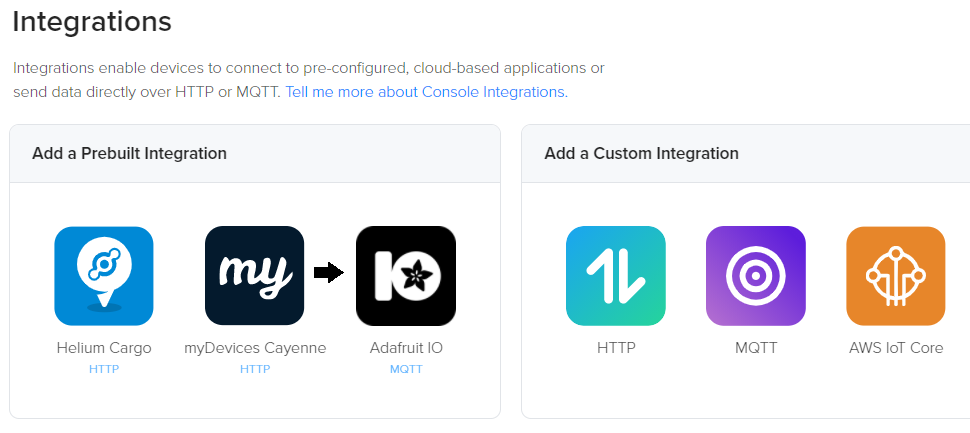
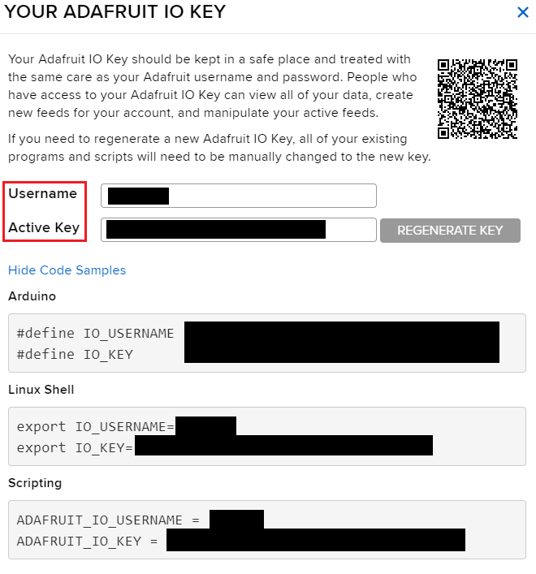
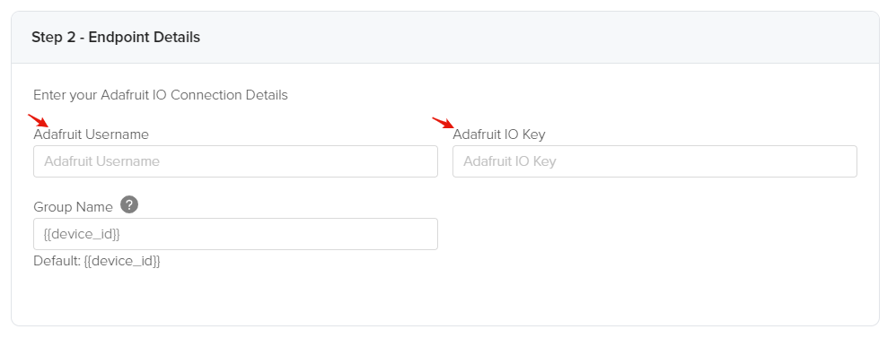

# AdafruitIO

[AdafruitIO ](https://io.adafruit.com/)is a powerful but simple to use Internet of Things platform from Adafruit.  It makes data from devices useful by allowing you to display, respond, and interact with it. You can sign up for a free account at [https://io.adafruit.com](https://io.adafruit.com/).

To add the integration in Console, go to **Integrations** on the left-hand menu. Select the integration to add - in this case, the **Adafruit IO** integration as shown below.

The next step is to enter your Adafruit IO username and key. These can be found by visiting [https://io.adafruit.com](https://io.adafruit.com/) and clicking _MyKey_ in the top right corner as shown below.

You will then be presented with both your username and key as shown below.

Copy these values into the username and key fields in Console for the integration configuration shown below.

Last for this step, you can optionally change the group name that is set to **{{device\_id}}** by default. ****The group name is used to group one or more data values that is received from a device and sent to AdafruitIO in a single message. This name is used as the default because it is guaranteed to be unique for every Helium device.  You can use any of the the available template tags which are auto populated when messages are actually sent, which are **{{device\_id}}**, **{{device\_eui}}**, and **{{device\_name}}.** This integration uses group topics to send device data to AdafruitIO over MQTT, you can read more about it [here](https://io.adafruit.com/api/docs/mqtt.html#group-topics). 

Next let's name the integration in step 3, you will use this name later to identify the integration when attaching it to devices.

The very last step is to select the decoder that will be used to decode the data payload received from your device.  We suggest using the _CayenneLPP_ decoder as shown below and encoding your data with CayenneLPP as this will be a seamless experience and not require any further configuration on Console. You can learn more about CayenneLPP encoding [here ](https://developers.mydevices.com/cayenne/docs/lora/#lora-cayenne-low-power-payload)as well as find an Arduino library for it [here](https://www.arduino.cc/reference/en/libraries/cayennelpp/). If you are comfortable with writing your own decoder and template then simply select _Custom_ and then search for your function decoder. Last be sure to click _Create Integration_ to finish.

## Connecting Integrations to Devices

Devices are connected to integrations through the use of Labels. Labels are named identifiers, that can be used to associate an integration with a device. To connect one or more devices to one or more integrations, simply attach the same label to both the device and integration. Labels need to be created before attaching them to devices and integrations. Read more on this [here](../labels.md).

