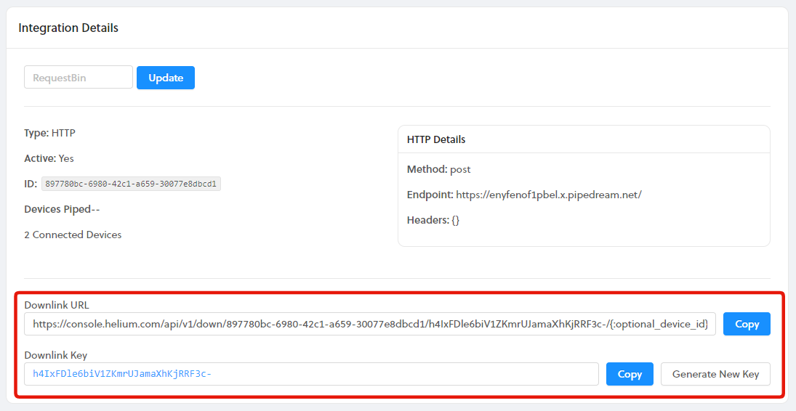

# HTTP


## Add an HTTP Integration

To add a Integration, go to **Integrations** on the left-hand menu. Select the integration to add - in this case, the **HTTP** integration.


The next step is to paste the HTTP endpoint.

If you're still testing, you can find popular sites that can create HTTP endpoints for you and inspect packets. [Requestbin](https://www.requestbin.com) and [Beeceptor](https://www.beeceptor.com) provide tools to make an HTTP endpoint quickly and easily.

### Uplink \(Receive Data from Device\)

Uplink refers to your device sending data to be received by the network. With regards to the HTTP integration, this will be the device data that is sent to your HTTP endpoint of choice. 

### RequestBin Example

Create an endpoint by going to requestbin.com and click **Create a Request Bin**. Once created, copy the endpoint.


... and paste it in Console.


**HTTP Header** and **Value** are not required and those can be left blank.

Lastly, provide a name for the integration. Names do not have to be unique.

Click **Create Integration**.

Your new integration is now ready for use! Please read about the [JSON schema](json-schema.md) to understand how to parse data received.

### Integration Details

View the details of your integration by clicking on the Integration name.

**Integration Details** shows the integration ID that is unique to each integration, the name, the type of integration, and whether it is active or not.

**HTTP Details** shows the specific endpoint. Editing endpoints is not available in the SDK Beta and will be coming soon. If you no longer want to use a integration, simply create a new one and redirect existing devices using the old integration to use the new one.

**Devices Piped** lists all the devices that are currently sending their data to the selected integration.

**Update your Connection Details** allows you to update your HTTP connection details for the currently viewed integration.

## Downlink \(Send Data to Device\)

Downlink refers to the network sending data down to be received by your device. With regards to the HTTP integration, this will be data sent to a unique URL called the `downlink_url` provided by Console.  

#### Downlink URL Format

`https://console.helium.com/api/v1/down/{Integration_ID}/{Downlink_Key}/{:optional_device_id}`

You can send downlinks to every device that your HTTP integration is attached to or just a single device by including the device UUID at the end. You can find this `downlink_url` with the required downlink key in it on the HTTP integration page in the details section, an example is shown below.



The downlink URL can aslo be found in the uplink JSON message for that particular device.  It will look similar to the URL shown below. You can also find it using the Debug window on your device page.

#### Downlink URL Example \(Device Specific\)

```text
"downlink_url": "https://console.helium.com/api/v1/down/897780bc-6980-42c1-a659-30077e8dbcd1/h4IxFDle6biV1ZKmrUJamaXhKjRRF3c-/d2c7b8dc-221a-4ec8-aedd-6c19ae348a33"
```

To send the downlink message, make a POST request including a JSON body with the following fields shown below, see more details on the fields [here](https://developer.helium.com/console/integrations/json-schema#downlink-transmitting-data-to-a-device).

#### Downlink JSON Message Example

```text
{
    "payload_raw": "SGVsbG8sIHdvcmxkIQ==",
    "port": 1,
    "confirmed": false
}
```

### Postman Example

Postman is a popular developer utility for HTTP based services, you can download it [here](https://www.postman.com/downloads/). We can use this utility to easily make a POST request to the downlink URL with our downlink JSON message.  Follow the steps below to successfully send your downlink message to your device.

1. Select the type of HTTP request, POST in this case.
2. Enter the downlink URL here.
3. Select Body to begin entering your message details.
4. Select `raw` as your body type.
5. Select `JSON` as the body format.
6. Enter your JSON message with the required fields.
7. Finally press `Send` to transmit the message.
8. You should see a response of `Downlink scheduled` if successful.


## Connecting Integrations to Devices

Devices are connected to integrations through the use of Labels. Labels are named identifiers, that can be used to associate an integration with a device. To connect one or more devices to one or more integrations, simply attach the same label to both the device and integration. Labels need to be created before attaching them to devices and integrations. You can read more about how to do that [here](https://developer.helium.com/console/labels).

