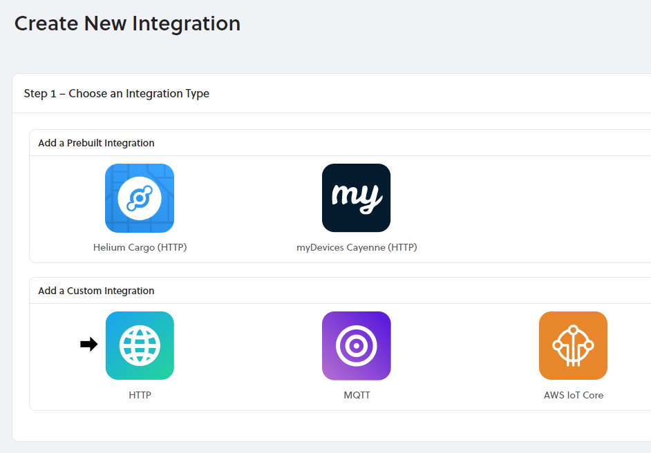
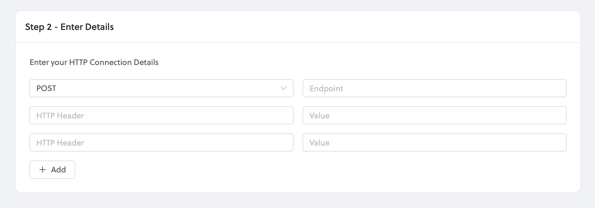

# HTTP


## HTTP Integration

### Add an HTTP Integration

To add a Integration, go to **Integrations** on the left-hand menu. Select the integration to add - in this case, the **HTTP** integration.



The next step is to paste the HTTP endpoint.

If you're still testing, you can find popular sites that can create HTTP endpoints for you and inspect packets. [Requestbin](https://www.requestbin.com) and [Beeceptor](https://www.beeceptor.com)provide tools to make an HTTP endpoint quickly and easily.

#### Requestbin Example

Create an endpoint by going to requestbin.com and click **Create a Request Bin**. Once created, copy the endpoint.


... and paste it in Console.



**HTTP Header** and **Value** are not required and those can be left blank.

Lastly, provide a name for the integration. Names do not have to be unique.

Click **Create Integration**.

Your new integration is now ready for use.

Below is an example of what an HTTP request would look like when received by the endpoint. The payload field is the actual data received from the device, encoded in a base64 string.

#### Example HTTP POST \(Uplink\):

```javascript
{
    "root":
    "app_eui": "415D0A10B5DD763A"
    "dev_eui": "7778223FAE245EA5"
    "gateway": "fancy-rusty-toad"
    "id": "3c822699-37fd-4df6-a84d-93037a450843"
    "name": "Home Disco"
    "payload": "SGVsbG8sIHdvcmxkIQ=="
    "rssi": -53
    "sequence": 2947
    "snr": 12.5
    "spreading": "SF9BW125"
    "timestamp": 1583339317
}
```

#### Integration Details

View the details of your integration by clicking on the Integration name.

**Integration Details** shows the integration ID that is unique to each integration, the name, the type of integration, and whether it is active or not.

**HTTP Details** shows the specific endpoint. Editing endpoints is not available in the SDK Beta and will be coming soon. If you no longer want to use a integration, simply create a new one and redirect existing devices using the old integration to use the new one.

**Devices Piped** lists all the devices that are currently sending their data to the selected integration.

**Update your Connection Details** allows you to update your HTTP connection details for the currently viewed integration.

### Connecting Integrations to Devices

Devices are connected to integrations through the use of Labels. Labels are named identifiers, that can be used to associate an integration with a device. To connect one or more devices to one or more integrations, simply attach the same label to both the device and integration. Labels need to be created before attaching them to devices and integrations. You can read more about how to do that [here](https://developer.helium.com/console/labels).

