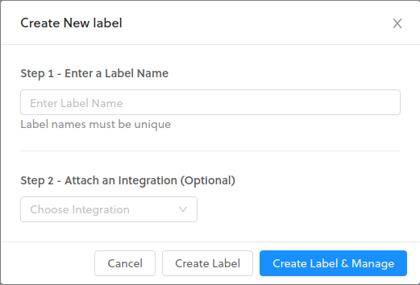

# Labels

Labels are a powerful mechanism used in Helium Console to organize devices, assign integrations, and provide scalability and flexibility to managing your projects.

## Organizing and Connecting with Labels

Devices can be both organized and connected to Integrations with the use of Labels. Labels are simply user defined identifiers, that can be attached to one or more devices, and one or more Integrations. Also multiple Labels can be added to a single device so users can choose to identify devices based on attributes such as geography \(e.g., SF\) and device type \(e.g., temperature or humidity\). 

Labels provide flexibility to define where to send data from devices. Users can apply a Label to an Integration and that Label can be used to connect a single or multiple devices to that Integration. For example, users could define an internal server as an Integration for initial testing and apply a descriptive Label \(e.g., internal\_test\). After ensuring devices send data, that internal\_test Label could easily be replaced by one that maps to a production endpoint \(AWS\).

Labels need to be created before attaching them to devices and integrations, read more below on how to do both. 

## Add Labels

When creating devices and integrations on Console, you will have the option to attach a custom Label to it. Before adding Labels to devices and integrations, you must create a new Label. To add a new Label, navigate to the **Labels** page using the left side navigation, and then click **Create New Label** in the upper right. You will be presented with the screen below.

## Attaching Labels

Labels can be attached to devices and integrations during or after creation. If you would like to attach a label to a device or integration during creation, make sure to create the label before hand, and it will be available to select. If you would like to attach a label after creating a new device or integration, go to the specific device or integration details page and find the label attachment dropdown to apply.

