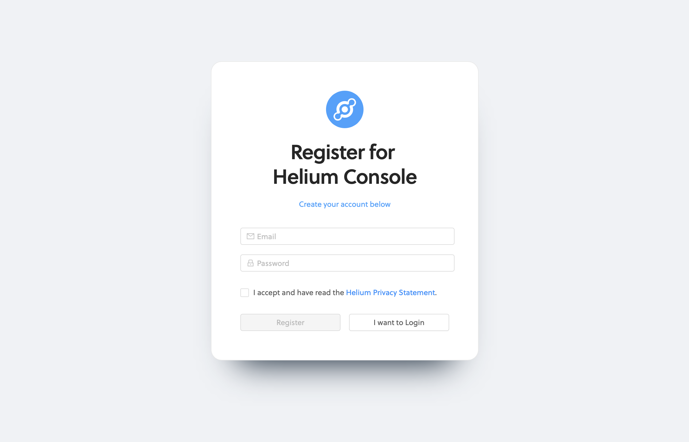

# Quickstart

## Objective

This Console quickstart guide will cover how to:

* Register an account on Helium Console 
* Add a device to Helium Console and record device details 


The cost per packet is $0.00001 USD \(24 byte packets\) which is equivalent to 1 Data Credit \(DC\). During the beta there is no cost to send packets. For more information please go here.


## Create an account

To register for an account, visit [Helium Console](https://console.helium.com) and click **Register**.

During Registration, you'll be asked to provide an Organization name and a Team name.

Define an Organization name for the top level owner of the account \(ie: company name\). Think of Teams as a way to organize groups of devices.

### Confirm your account

A confirmation email will be sent to the email address used to create an account. You must confirm the account in order to continue using Console. If you did not receive an email, please check your spam folders.

## Device Management

Helium Console allows developers to add devices and grab the device identifiers to load onto their device firmware that authenticates and identifies the device for the Helium Network.

### Add a Device

To add a device, go to **Devices** and click the **+ Add Device** icon on the top right of the window.

When prompted, enter a name for your device. Device names do not have to be unique \(as every device will be given a unique identifier generated by Console\). `DevEUI`, `AppEUI`, and `AppKey` are auto generated by the Helium Console when you create a new device. However, you can input your own `DevEUI`, `AppEUI`, and `AppKey` if your device is already provisioned with these credentials.

Once added, you'll see a consolidated view of all your device details, as well as the Activation Method \(only `OTAA` is currently supported\) and the LoRaWAN US Channels used by the Helium Network \(which will always be `sub-band 7`\).

## Live Data and Event Logs

When a valid data packet is received from that device, a dot will appear from the left side of the chart and flow towards the right as time goes on.

Blue dots represent packets that have been successfully sent to endpoints, while orange dots have failed to reach an endpoint, and red dots do not have a defined endpoint.

The size of the dot is related to the size of the packet. Larger sized packets will be a larger dot, and small data packets will be a smaller dot.

### Event Log

Event Logs display real-time packets in table form. Here you can see which Hotspot received the packet, its RSSI, and the size of the packet in bytes.

## Next Steps

Now that we've added a device on Console, let's build our device!

We've curated an Arduino quickstart guide for you to follow, which you can access directly below.

* [LongFi Arduino - Quickstart](https://github.com/helium/devdocs/tree/67b988ec351854ec4b7608e12b5b8f47f2456abf/device/arduino-quickstart/README.md)

