# LongFi Arduino Quickstart


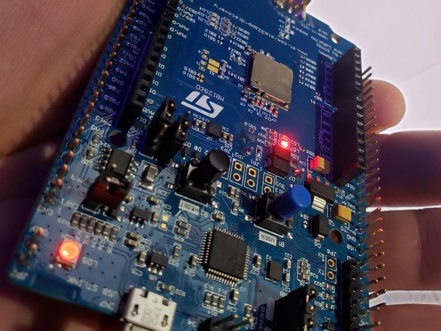

## Introduction

Helium’s LongFi architecture combines LoRaWAN and the Helium blockchain to create a wireless peer-to-peer network for low-bandwidth IoT applications. This guide will show you step by step how to transmit LoRaWAN packets using a longfi-arduino sketch on an STMicroelectronics B-L072Z-LRWAN1 Discovery kit.


Before we begin, please make sure you've followed the steps from this [guide](https://developer.helium.com/console/quickstart), which goes over some initial setup steps.


## Objective and Requirements

In this guide, you will learn:

* How to setup your environment \(Add STM32 board support to Arduino IDE and STLink debugging utility\)
* How to build and program a basic application that will send packets over the Helium Network
* Verify real-time packets sent to the Helium Console via Hotspot that's in range

For this example, you will need the following:

### Hardware

* [STMicroelectronics B-L072Z-LRWAN1 Discovery kit](https://www.st.com/en/evaluation-tools/b-l072z-lrwan1.html)
* Micro USB Type B Cable - [Example](https://www.amazon.com/AmazonBasics-Male-Micro-Cable-Black/dp/B0719H12WD/ref=sr_1_2_sspa?)

### Software

* [Arduino software \(IDE\)](https://www.arduino.cc/en/Main/Software) 
* [STM32 Board Support](https://github.com/stm32duino/Arduino_Core_STM32#getting-started) 
* [STLink Debugging Utility](https://www.st.com/en/development-tools/stm32cubeprog.html) 
* [Helium Console](https://console.helium.com/) 

## Hardware Setup

The build for this project is easy! You’ll just need to install the included antenna.

We'll be using the ST-Link debugger on the Discovery board, so you'll want to connect the micro-USB B connector to the micro-USB port labeled `CN7 USB STLINK`.


If you will be running the device using the AAA battery supply, you will need to remove a resistor on the underside of the board. We can just move it over to one of the pads and leave it attached for later. **You don't have to worry about this right now, as we will be powering the board off the MicroUSB connection.** 


That’s it for the hardware setup! Next we will setup your environment. We are going to use the Arduino IDE here. \(Intsructions on how do use [PlatformIO](https://platformio.org/) for this will be added soon.\)

### Getting the Arduino IDE

Download and install the latest version of [Arduino IDE](https://www.arduino.cc/en/Main/Software) for your preferred OS.

* [Windows](https://www.arduino.cc/en/Guide/Windows)
* [Linux](https://www.arduino.cc/en/Guide/linux)
* [Mac OSX](https://www.arduino.cc/en/Guide/MacOSX)

### Add STM32 board support to Arduino

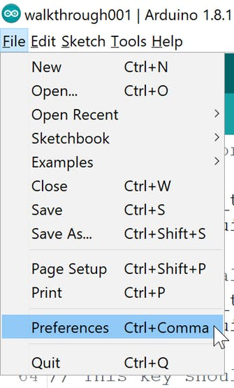

And add the following line under "Additional Boards Manager URLs":

```markup
https://github.com/stm32duino/BoardManagerFiles/raw/master/STM32/package_stm_index.json
```

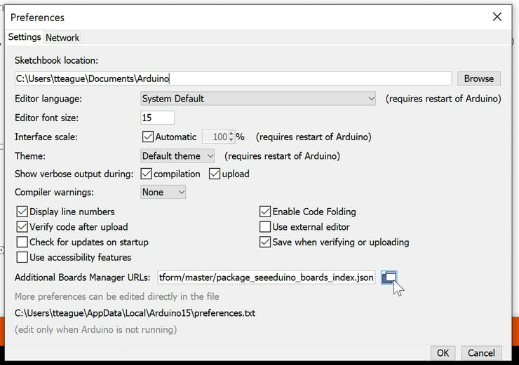

Now go to your `Boards Manager`, Select the "STM32 Cores" and click on Install:


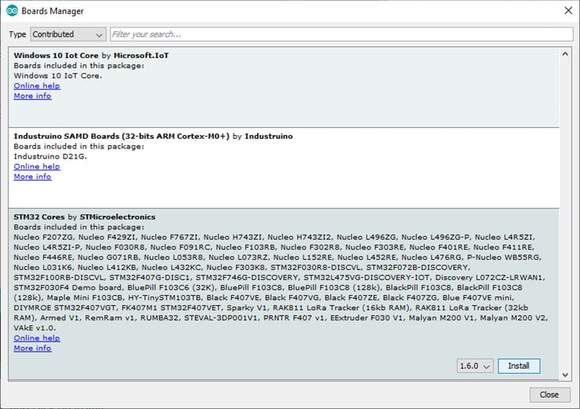

### Install MCCI LoRaWAN LMIC Library

The MCCI LoRaWAN LMIC Library then needs to be installed from the Arduino IDE if you don't already have it.


If you have already installed the MCCI LMIC library, please make sure to check for updates.


From inside the Arduino IDE:

```text
Sketch -> Include Libraries -> Manage Libraries
```

Search for `MCCI LMIC` and install the latest version of `MCCI LoRaWAN LMIC Library`

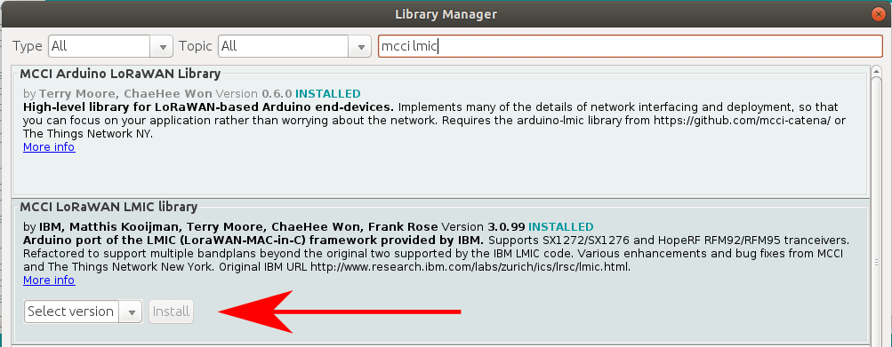

## LongFi Example Sketch and Sending Data

This [an example sketch](https://github.com/helium/longfi-arduino/blob/master/longfi-us915/longfi-us915.ino) is included in the LongFi repository and we'll be using it for this demo.

To deploy it, create a new sketch and copy the source code over. All you need to do is update it with the the `DevEUI`, `AppEUI`, and `AppKey` generated for you when you [create a device](https://github.com/helium/devdocs/tree/67b988ec351854ec4b7608e12b5b8f47f2456abf/console/quickstart/README.md) in [Helium Console](https://console.helium.com).

Note that the byte ordering of the `DevEUI`, `AppEUI`, and `AppKey` are important.

* `DevEUI` and `AppEUI` need to be copied over in the `LSB` format. 
* `AppKey` needs to be input using `MSB`


Be sure to select the appropriate format and copy the information into the sketch:

```c
static const u1_t PROGMEM DEVEUI[8]= {0xDE, 0xAD, 0xBE, 0xEF, 0xFE, 0xED, 0xFF, 0xFF };
void os_getDevEui (u1_t* buf) { memcpy_P(buf, DEVEUI, 8);}

static const u1_t PROGMEM APPEUI[8]= { 0x81, 0x6A, 0xE9, 0xDD, 0x50, 0xD8, 0x16, 0x8B };
void os_getArtEui (u1_t* buf) { memcpy_P(buf, APPEUI, 8);}

static const u1_t PROGMEM APPKEY[16] = { 0x29, 0xFE, 0xF6, 0x75, 0x97, 0x18, 0xE3, 0x25, 0x72, 0x64, 0xBA, 0x25, 0x82, 0x8C, 0x94, 0xFA };
void os_getDevKey (u1_t* buf) {  memcpy_P(buf, APPKEY, 16);}
```

### Adding B-L072Z-LRWAN1 Board Support

You then need to configuring the Arduino IDE for the `B-L072Z-LRWAN1 - ST STM32L0 Discovery kit`. \(Full istructions to install the board support package can be found [here](https://github.com/stm32duino/Arduino_Core_STM32#getting-started) but we'll walk you through it below.\)

In the Arduino IDE:

```text
Select Tools -> Board -> Discovery
```

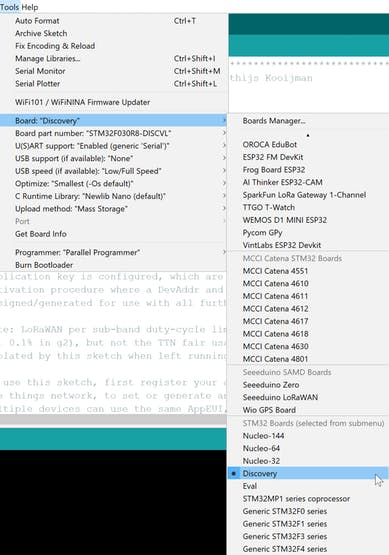

```text
Select Tools -> Board part number -> Discovery L072Z-LRWAN1
```

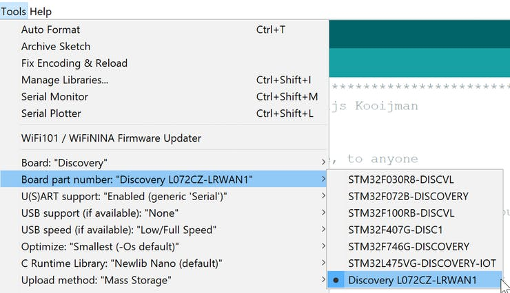

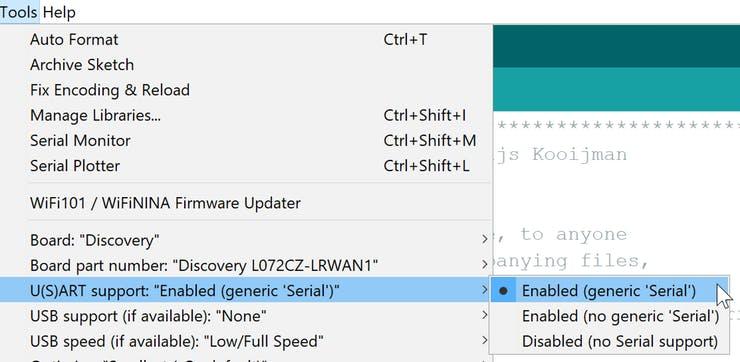

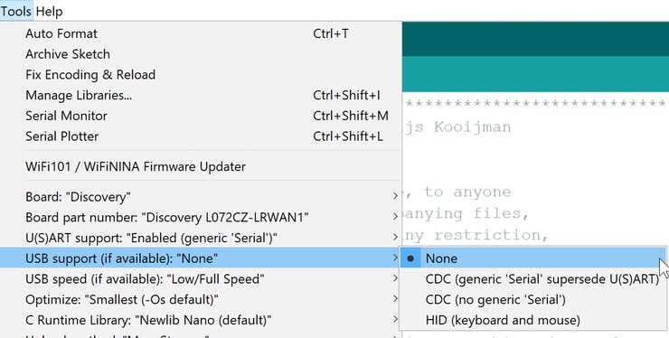

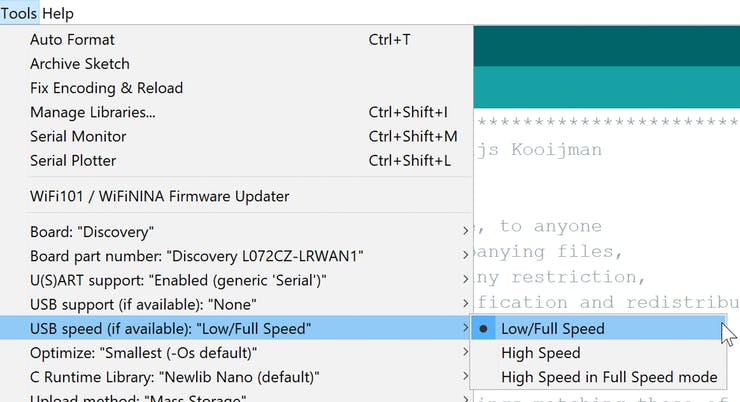


### Programming \(Upload Method\)

Now we're ready to upload our Sketch. For this, we will use the onboard ST-Link \(Flasher/Debugger\).

Download and install the required utility from ST [here](https://www.st.com/en/development-tools/stm32cubeprog.html)

The download comes in the form of a `stm32cubeprog.zip` file, which you'll need to unpack. After you unzip, you should see the following files:

```c
SetupSTM32CubeProgrammer-[version].exe

SetupSTM32CubeProgrammer-[version].linux
SetupSTM32CubeProgrammer-[version].app
```

### Installation Requirements

**Supported operating systems and architectures**

* Linux 64-bit 
* Windows 7/8/10 32-bit and 64-bit 
* MacOS \(minimum version OS X Yosemite\)

**Software Requirements**

* [Java SE Run Time Environment 1.8](https://www.oracle.com/technetwork/java/javase/downloads/jre8-downloads-2133155.html) or newer must be installed \(from Oracle\)

### Windows Instructions

The download comes with a `SetupSTM32CubeProgrammer-[version].exe`, which guides you through the installation process.

### Linux Instructions

The download comes with a `SetupSTM32CubeProgrammer-[version].linux`, which guides you through the installation process.

### MacOS Instructions

Run the following command:

`java -jar SetupSTM32CubeProgrammer-[version].exe`

**You should use the default installation path.**

In the Arduino IDE:

```text
Select Tools -> Upload Method -> STM32CubeProgrammer(SWD)
```

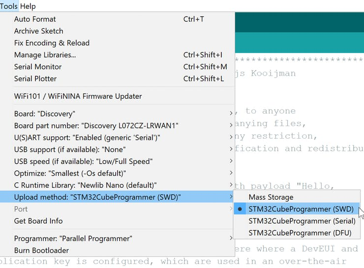

### Programming your Arduino Sketch and Sending Data

From the Arduino IDE:

```text
Select Sketch -> Verify/Compile (Ctrl + R)
```

If there are no errors with your sketch, you should see `Done Compiling`.

Then, you can upload the sketch and program the development board.

Arduino IDE:

```text
Select Sketch -> Upload (Ctrl + U)
```

Congratulations! You have just programmed your first Helium LongFi application!

However, we are not done just yet. Now let's head back to [Helium Console](https://console.helium.com) and look at our device.

You should be able to see some packets appear as Live Data.

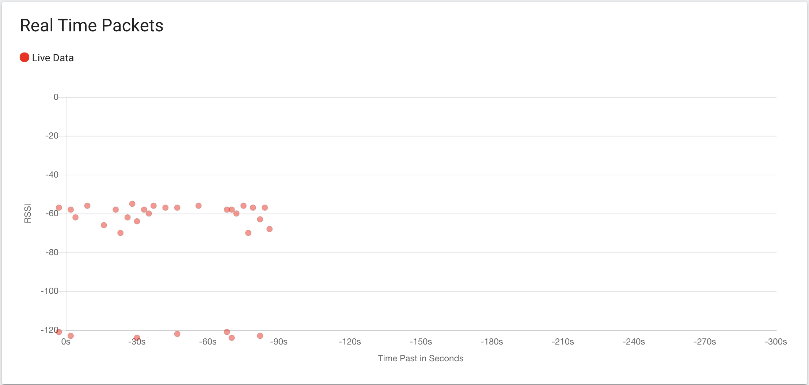

