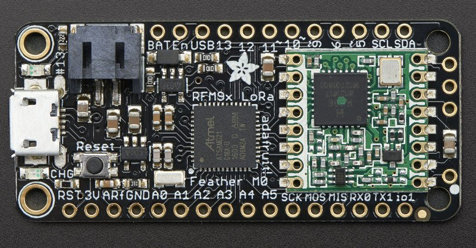
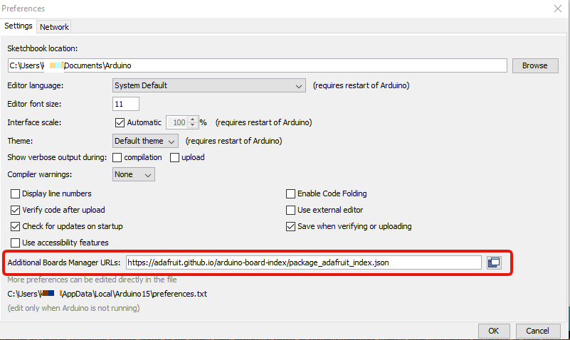
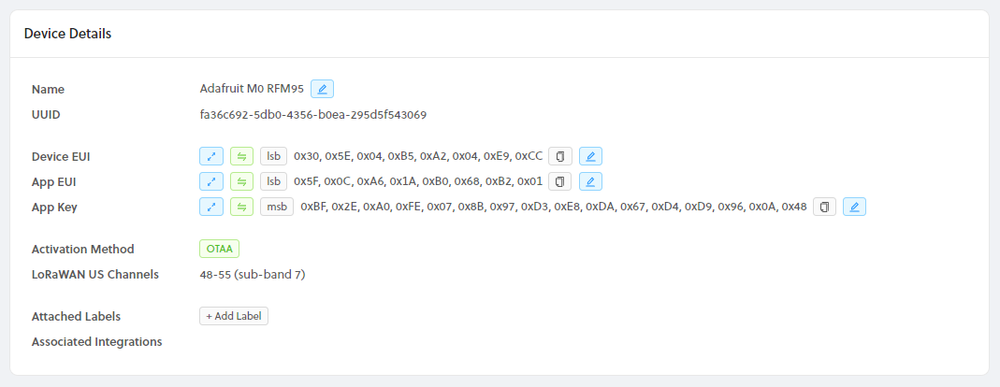
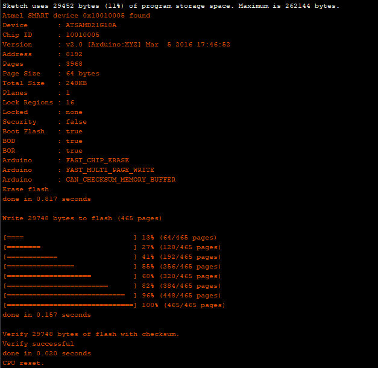
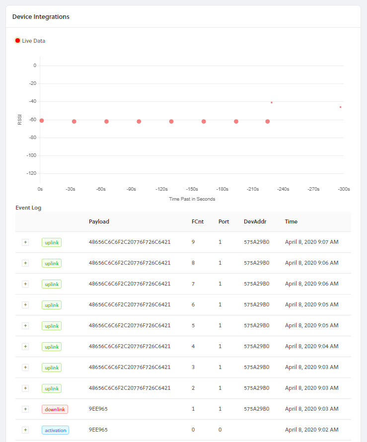

# Adafruit Feather M0 RFM95



## Introduction

This guide will show you step by step how to transmit LoRaWAN packets using a longfi-arduino sketch on a [Adafruit Feather M0 - RFM95](https://www.adafruit.com/product/3178).


Before we begin, please make sure you've followed the steps from this [guide](https://developer.helium.com/console/quickstart), which goes over some initial steps to add your device to Console.


## Objective and Requirements

In this guide, you will learn:

* How to setup your environment
* How to program a basic application that will send packets over the Helium Network
* Verify real-time packets sent to the Helium Console via Hotspot that's in range

For this example, you will need the following:

### Hardware

* [Adafruit Feather M0 - RFM95](https://www.adafruit.com/product/3178)
* Micro USB Type B Cable - [Example](https://www.amazon.com/AmazonBasics-Male-Micro-Cable-Black/dp/B0719H12WD/ref=sr_1_2_sspa?)

### Software

* [Arduino software \(IDE\)](https://www.arduino.cc/en/Main/Software) 
* [Helium Console](https://console.helium.com/) 

## Hardware Setup

This step will cover adding an antenna and closing the LoRaWAN jumpers on this board.

### Adding the Antenna

Please visit Adafruit's Documentation for antenna options and instructions [here](https://learn.adafruit.com/adafruit-feather-m0-radio-with-lora-radio-module/antenna-options).

### Jumping IO1 to Pin6

In order to use the RFM95 radio module onboard the Feather M0 for LoRaWAN we'll need to connect two pins together.  The pins are labeled io1 and 6 on the board, as shown below. If you have the headers soldered on, you can use a female to female jumper cable to connect them, or you can simply solder a wire from pin to pin.


## Software Setup

### Getting the Arduino IDE

Download and install the latest version of [Arduino IDE](https://www.arduino.cc/en/Main/Software) for your preferred OS.

* [Windows](https://www.arduino.cc/en/Guide/Windows)
* [Linux](https://www.arduino.cc/en/Guide/linux)
* [Mac OSX](https://www.arduino.cc/en/Guide/MacOSX)

### Arduino Board Support

The Adafruit Feather M0 requires two Arduino board support packages. Follow the instructions below to install both.

#### Arduino SAMD Boards \(32-bits ARM Cortex-M0+\)

To install, open your Arduino IDE:

1. Navigate to \(**Tools &gt; Boards &gt; Boards Manager...\)**
2. Search for **Arduino SAMD Boards \(32-bits ARM Cortex-M0+\)**
3. Select the newest version and click Install

#### Adafruit SAMD Boards

To install, open your Arduino IDE:

1. Navigate to **\(File &gt; Preferences\), \(Arduino &gt; Preferences\) on MacOS.**
2. Find the section at the bottom called **Additional Boards Manager URLs:**



1. Add this URL in the text box:

```text
https://adafruit.github.io/arduino-board-index/package_adafruit_index.json
```

1. Close the Preferences windows

Next, to install this board support package:

1. Navigate to \(**Tools &gt; Boards &gt; Boards Manager...\)**
2. Search for  **Adafruit SAMD Boards**
3. Select the newest version and click Install

### Arduino Library

To communicate with Helium's LoRaWAN network, we'll need to install an Arduino library.

To install, open your Arduino IDE:

1. Navigate to Library Manager \(**Sketch &gt; Include Library &gt; Manage Libraries**\).
2. In the search box, type **IBM LMIC framework** into the search, select the version shown below, and click Install.


#### Update IBM LMIC framework config.h

This library requires that a config file be setup properly. After you have installed the `IBM LMIC framework` library, navigate to it's directory on your operating system found below. Next, replace the `config.h` file in this directory with this [config.h](https://github.com/helium/longfi-arduino/blob/master/Adafruit-Feather-M0-RFM95/longfi-us915/config.h) file.

linux: /home/{user}/Arduino/libraries/IBM\_LMIC\_framework/src/lmic  
windows: Documents/Arduino/libraries/IBM\_LMIC\_framework/src/lmic  
mac os: Documents/Arduino/libraries/IBM\_LMIC\_framework/src/lmic

### Programming **Example Sketch**

Now that we have the required Arduino board support and library installed, lets program the board with the provided example sketch.

To create a new Arduino sketch, open your Arduino IDE, \(**File &gt; New\).** Next, replace the template sketch with the sketch found [here](https://github.com/helium/longfi-arduino/blob/master/Adafruit-Feather-M0-RFM95/longfi-us915/longfi-us915.ino), copy and paste the entirety of it.

Next we'll need to fill in the AppEUI\(lsb\), DevEUI\(lsb\), and AppKey\(msb\), in the sketch, which you can find on the device details page on Console. Be sure to use the formatting buttons to match the endianess and formatting required for the sketch, shown below.



At the top of the sketch, replace the three **FILL\_ME\_IN** fields, with the matching field from Console, example shown below.


### Selecting Board

Next, we need to select the correct board to build for in the Arduino IDE. Navigate to \(**Select Tools &gt; Board: &gt; Adafruit Feather M0\).**

### Enter Bootloader Mode

Next, we need to place the board into bootloader mode, which allows us to update it with new firmware. To do this, first plug the device into your computer, make sure the power switch is turned on \(you should see a red LED on\). Next, quickly double click the reset push button on the top side of the board, you should see the red LED slowly blink. If you see this then you have successfully entered bootloader mode.

### Selecting Port

We're almost ready to upload our sketch, the very last step is to select the correct Serial port in the Arduino IDE. Navigate to \(**Tools &gt; Port: Adafruit Feather M0**\). You will also see either **COM\# or /dev/ttyACM\#** depending on whether you are on Windows, Mac, or Linux. If you do not see a port, please visit the Drivers section in [Adafruit's Docs](https://learn.adafruit.com/adafruit-feather-m0-radio-with-lora-radio-module/using-with-arduino-ide#install-drivers-windows-7-and-8-only-6-11) to make sure you have what's needed for your operating system.

### Upload Sketch

We're finally ready to upload our sketch to the board. In the Arduino IDE, click the right arrow button, or navigate to \(**Sketch &gt; Upload\),** to build and upload your new firmware to the board. You should see something similar to the image below at the bottom of your Arduino IDE, when the upload is successful.



### Viewing Serial Output

When your firmware update completes, the board will reset, and begin by joining the network. Let's use the Serial Monitor in the Arduino IDE to view the output from the board. We first need to select the serial port again, but this time it will be a **different port** than the one we selected to communicate with the bootloader. Once again, navigate to \(**Tools &gt; Port: Adafruit Feather M0**\), but make sure the serial device, either COM\# or ttyACM\#, is different! Next navigate to \(**Tools &gt; Serial Monitor**\), you should begin to see output similar to below.


Now let's head back to [Helium Console](https://console.helium.com) and look at our device page, you should see something similar to the screenshot below.



Congratulations! You have just transmitted data on the Helium network! The next step is to learn how to use your device data to build applications, visit our Integrations docs [here](../../console/integrations/).

