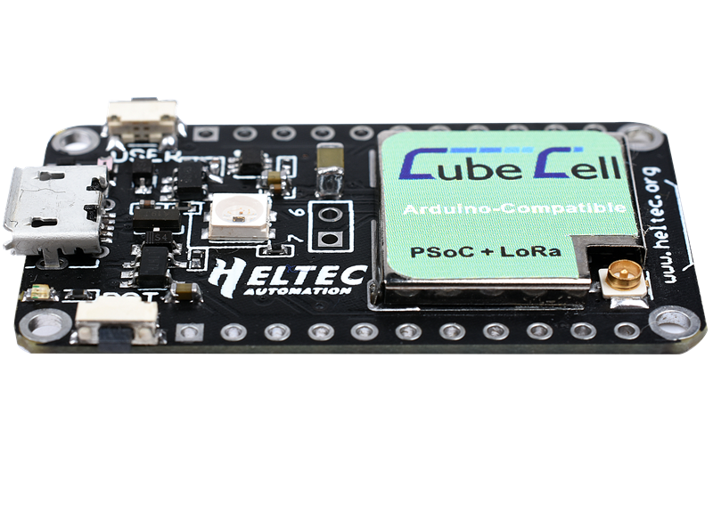
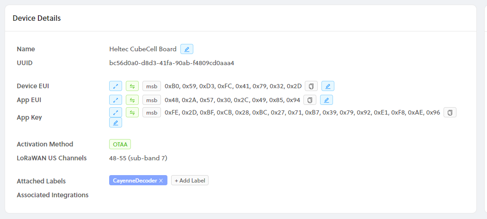
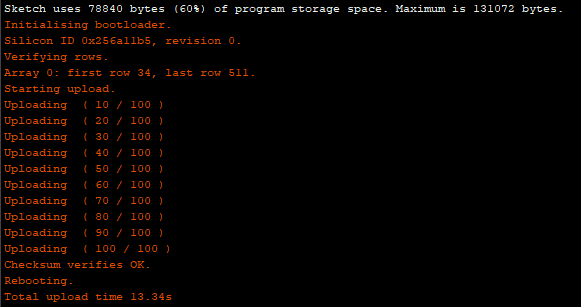
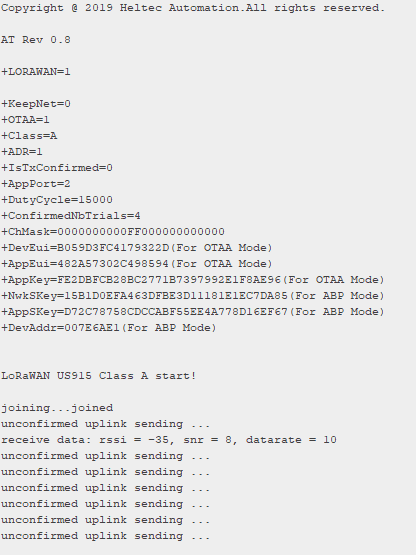

# Heltec CubeCell Board



## Introduction

This guide will show you step by step how to transmit LoRaWAN packets using a longfi-arduino sketch on a [Heltec CubeCell Board](https://heltec.org/project/htcc-ab01/).


Before we begin, please make sure you've followed the steps from this [guide](https://developer.helium.com/console/quickstart), which goes over some initial steps to add your device to Console.


Our Helium community member @suprnrdy has a store set up in the US at [https://parleylabs.com/shop/](https://parleylabs.com/shop/) where you can find multiple variants of the CubeCell boards.

## Objective and Requirements

In this guide, you will learn:

* How to setup your environment
* How to program a basic application that will send packets over the Helium Network
* Verify real-time packets sent to the Helium Console via Hotspot that's in range

For this example, you will need the following:

### Hardware

* [Heltec CubeCell Board](https://heltec.org/project/htcc-ab01/)
* Micro USB Type B Cable - [Example](https://www.amazon.com/AmazonBasics-Male-Micro-Cable-Black/dp/B0719H12WD/ref=sr_1_2_sspa?)

### Software

* [Arduino software \(IDE\)](https://www.arduino.cc/en/Main/Software) 
* [Helium Console](https://console.helium.com/) 

## Hardware Setup <a id="hardware-setup"></a>

### Adding the Antenna <a id="adding-the-antenna"></a>

Your board should have come with a U.FL antenna. All you have to do is attache it to the U.FL port as shown in the image at the top of the guide.

### Connect Board <a id="connect-board"></a>

Next, lets connect our board to our computer with a USB 2.0 A-Male to Micro B cable.

## Software Setup <a id="software-setup"></a>

### Getting the Arduino IDE <a id="getting-the-arduino-ide"></a>

Download and install the latest version of [Arduino IDE](https://www.arduino.cc/en/Main/Software) for your preferred OS.

* ​[Windows](https://www.arduino.cc/en/Guide/Windows)​
* ​[Linux](https://www.arduino.cc/en/Guide/linux)​
* ​[Mac OSX](https://www.arduino.cc/en/Guide/MacOSX)​

### Arduino Board Support <a id="arduino-board-support"></a>

The Heltec CubeCell Board requires one Arduino board support package. Follow the instructions below to install.

#### CubeCell Dev-boards <a id="arduino-esp32"></a>

To install, open your Arduino IDE:

1. Navigate to **\(File &gt; Preferences\), \(Arduino &gt; Preferences\) on MacOS.**
2. Find the section at the bottom called **Additional Boards Manager URLs:**


1. Add this URL in the text box:

```text
http://resource.heltec.cn/download/package_CubeCell_index.json
```

1. Close the Preferences windows

Next, to install this board support package:

1. Navigate to \(**Tools &gt; Boards &gt; Boards Manager...\)**
2. Search for  **CubeCell Dev-boards**
3. Select the newest version and click Install


### Manual updates to the Heltec runtime libraries

#### Verify Data Rate

Some versions of Heltec's runtime libraries have set a default configuration variable to a value that is incompatible with the Helium network, especially when the Heltec device is configured for the North American market. Before attempting to use the libraries it is best to verify the value of the variable.

The location of the file of interest depends on the library installation directory of the IDE you are using, Arduino IDE vs Platformio IDE, as well as the host platform, Windows vs Linux vs Mac. With the Arduino IDE location, the library version number may also be different depending on when you download the package.

For example on a Linux platform the files should be located at:

Arduino IDE library version 1.0.0:

```text
~/.arduino15/packages/CubeCell/hardware/CubeCell/1.0.0/libraries/LoRa/src/LoRaWan_APP.cpp
```

Platformio IDE:

```text
~/.platformio/packages/framework-arduinoasrmicro650x/libraries/LoRa/src/LoRaWan_APP.cpp
```

In LoRaWan\_APP.cpp look for \#define LORAWAN\_DEFAULT\_DATARATE  
Depending on the version of the Heltec runtime that is installed this default may be set to DR\_0, DR\_3, DR\_5 or some other value. Note: DR\_5 is not valid for US915, the North American market.

The LORAWAN\_DEFAULT\_DATARATE setting is tied directly to the maximum size of the data packet you are transferring. While other runtime versions may allow programatic overide of this default, the Heltec implementation does not currently support overriding.

NOTE: If you try to transfer a packet that is larger than this setting allows, your device may successfully join the network but the data transmit will fail silently.

| Data Rate \(DR\) | Max Application Payload |
| :--- | :--- |
| DR\_0 | 11 bytes |
| DR\_1 | 53 bytes |
| DR\_2 | 125 bytes |
| DR\_3 | 242 bytes |
| DR\_4 | 242 bytes |
| DR\_5 - 7 | Not Valid |

Update the LORAWAN\_DEFAULT\_DATARATE as appropriate for your application needs.

The above values are valid for the US902-928MHz region\(North America\), the values may differ for other LoRa regions, which you can find [here](https://lora-alliance.org/resource-hub/rp2-101-lorawanr-regional-parameters).

#### LoRaWAN preamble size

There are some versions of the Heltec runtime libraries that may set a LoRaWAN preamble size that is incompatible with the current LoRaWan specification. If the preamble size is not set correctly your device cannot join the network.

This should be verified in the following file corresponding to your target LoRaWan region. For region US915 this file is RegionUS915.c:

For Arduino IDE library version 1.0.0 the file is located:

```text
~/.arduino15/packages/CubeCell/hardware/CubeCell/1.0.0/cores/asr650x/loramac/mac/region/RegionUS915.c
```

Platformio IDE:

```text
~/.platformio/packages/framework-arduinoasrmicro650x/cores/asr650x/loramac/mac/region/RegionUS915.c
```

In this file the line: \( your version could have 14 or 16 for the 7th parameter, it needs to be 8\)

Change:

```text
Radio.SetTxConfig( MODsEM_LORA, phyTxPower, 0, bandwidth, phyDr, 1, 14, false, true, 0, 0, false, 3e3 );
```

To:

```text
Radio.SetTxConfig( MODEM_LORA, phyTxPower, 0, bandwidth, phyDr, 1, 8, false, true, 0, 0, false, 3e3 );
```

Heltec support has been notified of these issues, hopefully a future release of those libs will resolve the issues.

### Install Serial Driver

Find Directions on Heltec's website [here](https://heltec-automation-docs.readthedocs.io/en/latest/general/establish_serial_connection.html).

### Select Board

Arduino IDE:

If you are using the HTCC-AB02 flavor of Heltec board 1. Select Tools -&gt; Board: -&gt;CubeCell-Board \(HTCC-AB02\)

If you are using the HTCC-AB02S GPS enabled flavor of Heltec board 1. Select Tools -&gt; Board: -&gt;CubeCell-GPS \(HTCC-AB02S\)

### Select Region

Arduino IDE: Until you are familiar with their configuration behavior it is recommended you set the board options as follows: 1. Select Tools -&gt; LORAWAN_REGION: -&gt; REGION\_US915 2. Select Tools -&gt; LORAWAN\_CLASS: -&gt; CLASS\_A 3. Select Tools -&gt; LORAWAN\_NETMODE: -&gt; OTTA 4. Select Tools -&gt; LORAWAN\_ADR: -&gt; OFF 5. Select Tools -&gt; LORAWAN\_UPLINKMODE: -&gt; UNCONFIRMED 6. Select Tools -&gt; LORAWAN\_Net\_Reservation: -&gt; OFF 7. Select Tools -&gt; LORAWAN\_AT\_SUPPORT: -&gt; OFF 8. Select Tools -&gt; LORAWAN\_AT\_RGB : -&gt; ACTIVE 9. Select Tools -&gt; LoRaWan_ Debug Level : -&gt; FREQ&&DIO \(for most verbose messages\)

### Select **Uplink Mode**

The last step before we upload our sketch is to select the LoRaWAN Uplink Mode, navigate to **\(Tools &gt; LoRaWAN Uplink Mode: &gt; UNCONFIRMED\).**

### Programming **Example Sketch**

Now that we have the required Arduino board support and library installed, lets program the board with the provided example sketch.

To create a new Arduino sketch, open your Arduino IDE, \(**File &gt; New\).** Next, replace the template sketch with the sketch found [here](https://github.com/helium/longfi-arduino/blob/master/Heltec-CubeCell-Board/longfi-us915/longfi-us915.ino), copy and paste the entirety of it.

Next we'll need to fill in the AppEUI\(msb\), DevEUI\(msb\), and AppKey\(msb\), in the sketch, which you can find on the device details page on Console. Be sure to use the formatting buttons to match the endianess and formatting required for the sketch, shown below.



At the top of the sketch, replace the three **FILL\_ME\_IN** fields, with the matching field from Console, example shown below.


### Upload Sketch

We're finally ready to upload our sketch to the board. In the Arduino IDE, click the right arrow button, or navigate to \(**Sketch &gt; Upload\),** to build and upload your new firmware to the board. You should see something similar to the image below at the bottom of your Arduino IDE, when the upload is successful.



### Using HTCC-AB02S Board With GPS Capable Sketch <a id="HTCC-AB02S-with-GPS"></a>

If you are using the HTCC-AB02S board with a sketch that is GPS enabled but find the device is unable to obtain a GPS lock you can try changing the GPS data satellite source via the GPS class Air530.setMode\(\) API. Add the Air530.setmode\(\) to the setup\(\) method of your sketch.

```text
// MODE_GPS - US,
// MODE_GPS_BEIDOU - Chinese - This is the default
// MODE_GPS_GLONASS - Russian
// set what works best for your connectivity, for example: 
Air530.setmode(MODE_GPS);
```

### Patching ADR Functionality

The CubeCell may have issues joining the network with ADR OFF. If you're using ADR ON, you may also encounter an issue where your CubeCell stops successfully sending packets after a few minutes. This is caused by the CubeCell firmware's ADR behavior, and may happen if your payload is above the DR0 maximum size \(11 bytes\).

To patch the CubeCell firmware, find and open the `RegionUS915.c` file in the firmware directory. On macOS, an example path would be `~/Library/Arduino15/packages/CubeCell/hardware/CubeCell/1.0.0/cores/asr650x/loramac/mac/region/RegionUS915.c`.

Find the following lines in the file and comment them out:

```text
// Decrease the datarate
getPhy.Attribute = PHY_NEXT_LOWER_TX_DR;
getPhy.Datarate = datarate;
getPhy.UplinkDwellTime = adrNext->UplinkDwellTime;
phyParam = RegionUS915GetPhyParam(&getPhy);
datarate = phyParam.Value;
```

This will prevent the CubeCell from reducing the Data Rate over time and allow you to send larger packets on a repeated, prolonged basis.

### Viewing Serial Output <a id="viewing-serial-output"></a>

When your firmware update completes, the board will reset, and begin by joining the network. Let's use the Serial Monitor in the Arduino IDE to view the output from the board. We first need to select the serial port again, but this time it will be a **different port** than the one we selected to communicate with the bootloader. Once again, navigate to \(**Tools &gt; Port: COM\#/ttyACM\#**\), but make sure the serial device, either COM\# or ttyACM\#, is different! Next navigate to \(**Tools &gt; Serial Monitor**\), you should begin to see output similar to below.



Now let's head back to [Helium Console](https://console.helium.com/) and look at our device page, you should see something similar to the screenshot below.


Congratulations! You have just transmitted data on the Helium network! The next step is to learn how to use your device data to build applications, visit our Integrations docs [here](../../console/integrations/).

