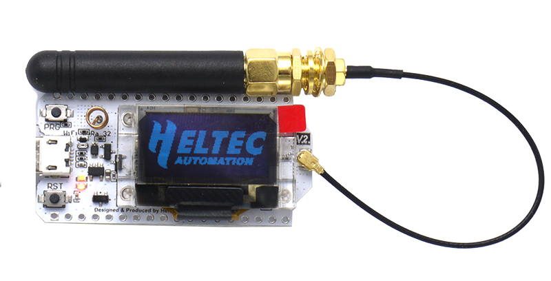
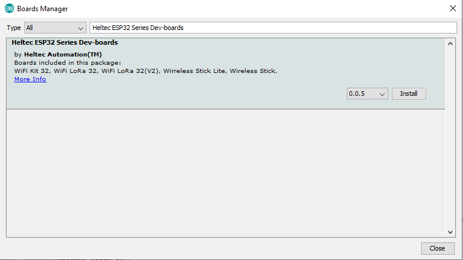
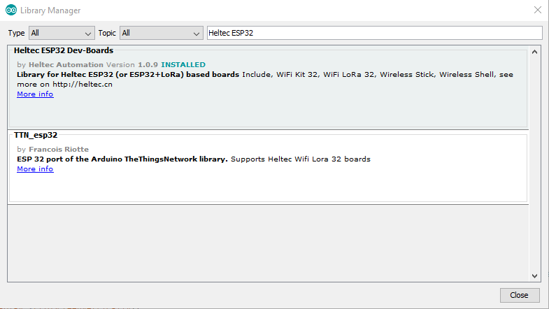
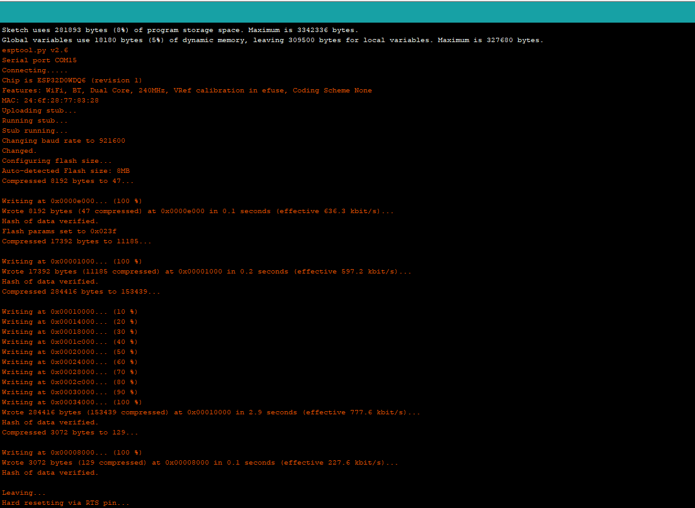
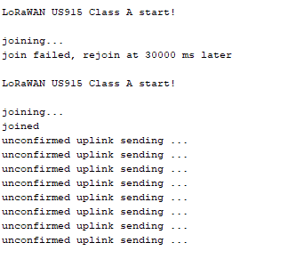
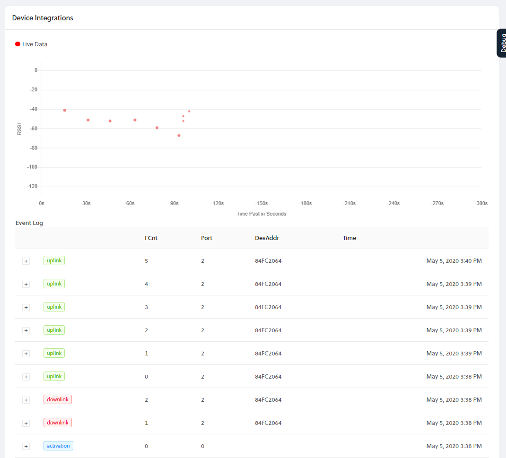

# Heltec WiFi LoRa 32 V2



## Introduction

This guide will show you step by step how to transmit LoRaWAN packets using a longfi-arduino sketch on a [Heltec WiFi LoRa 32 V2](https://heltec.org/project/wifi-lora-32/).


Before we begin, please make sure you've followed the steps from this [guide](https://developer.helium.com/console/quickstart), which goes over some initial steps to add your device to Console.


## Objective and Requirements

In this guide, you will learn:

* How to setup your environment
* How to program a basic application that will send packets over the Helium Network
* Verify real-time packets sent to the Helium Console via Hotspot that's in range

For this example, you will need the following:

### Hardware

* [Heltec WiFi LoRa 32 V2](https://heltec.org/project/wifi-lora-32/)
* Micro USB Type B Cable - [Example](https://www.amazon.com/AmazonBasics-Male-Micro-Cable-Black/dp/B0719H12WD/ref=sr_1_2_sspa?)

### Software

* [Arduino software \(IDE\)](https://www.arduino.cc/en/Main/Software) 
* [Helium Console](https://console.helium.com/) 

## Hardware Setup

### Adding the Antenna

Your board should have come with a U.FL antenna. All you have to do is attache it to the U.FL port as shown in the image at the top of the guide.

### Connect Board

Next, lets connect our board to our computer with a USB 2.0 A-Male to Micro B cable. 

## Software Setup

### Getting the Arduino IDE

Download and install the latest version of [Arduino IDE](https://www.arduino.cc/en/Main/Software) for your preferred OS.

* [Windows](https://www.arduino.cc/en/Guide/Windows)
* [Linux](https://www.arduino.cc/en/Guide/linux)
* [Mac OSX](https://www.arduino.cc/en/Guide/MacOSX)

### Arduino Board Support

The Heltec WiFi LoRa 32 V2 requires one Arduino board support package. Follow the instructions below to install.

#### Arduino-ESP32

To install, open your Arduino IDE:

1. Navigate to **\(File &gt; Preferences\)**
2. Find the section at the bottom called **Additional Boards Manager URLs:**


3.  Add this URL in the text box:

```text
http://resource.heltec.cn/download/package_heltec_esp32_index.json
```

4. Close the Preferences windows

Next, to install this board support package:

1. Navigate to \(**Tools &gt; Boards &gt; Boards Manager...\)**
2. Search for  **Heltec ESP32**
3. Select the newest version and click Install



### Arduino Library

To communicate with Helium's LoRaWAN network, we'll need to install an Arduino library.

To install, open your Arduino IDE:

1. Navigate to Library Manager \(**Sketch &gt; Include Library &gt; Manage Libraries**\).
2.  In the search box, type **Heltec ESP32** into the search, select the version shown below, and click Install.



### Install Serial Driver

Find Directions on Heltec's website [here](https://heltec-automation-docs.readthedocs.io/en/latest/general/establish_serial_connection.html).

### Select Board

Arduino IDE:

1. Select Tools -&gt; Board: -&gt; WiFi LoRa 32\(V2\)

### Obtain Heltec License Key

#### **Upload GetChipID example**

Arduino IDE:

1. Select File -&gt; Examples -&gt; ESP32 -&gt; ChipID -&gt; GetChipID
2. Select Tools -&gt; Port: "COM\# or ttyACM\#"
3. Select Sketch -&gt; Upload
4. Wait for Done uploading message
5. Select Tools -&gt; Serial Monitor Serial Monitor Window
6. Select 115200 baud from bottom right dropdown.
7. You should see something that looks like this every second `ESP32 Chip ID = ############`
8. Save this Chip ID

#### Obtain License Key with Chip ID

1. Go to [resource.heltec.cn/search](http://resource.heltec.cn/search) 
2. Enter ChipID 
3. Save license field, will look like `0x########,0x#########,0x########,0x########`

### Programming **Example Sketch**

Now that we have the required Arduino board support and library installed, lets program the board with the provided example sketch.

To create a new Arduino sketch, open your Arduino IDE, \(**File &gt; New\).** Next, replace the template sketch with the sketch found [here](https://github.com/helium/longfi-arduino/blob/master/Heltec-WiFi-LoRa-32-V2/longfi-us915/longfi-us915.ino), copy and paste the entirety of it. 

Next we'll need to fill in the AppEUI\(msb\), DevEUI\(msb\), and AppKey\(msb\), in the sketch, which you can find on the device details page on Console. Be sure to use the formatting buttons to match the endianess  and formatting required for the sketch, shown below.


At the top of the sketch, replace the three **FILL\_ME\_IN** fields, with the matching field from Console, example shown below.


### Selecting Port

Next, we need to select the correct Serial port in the Arduino IDE. Navigate to \(**Tools &gt; Port: COM\#/ttyACM\#**\). You will also see either **COM\# or /dev/ttyACM\#** depending on whether you are on Windows, Mac, or Linux. If you do not see a port, please visit the Drivers section in [Heltec's docs](https://heltec-automation-docs.readthedocs.io/en/latest/general/establish_serial_connection.html) to make sure you have what's needed for your operating system.

### Select LoRaWAN Region

The last step before we upload our sketch is to select the correct LoRaWAN Region, navigate to **\(Tools &gt; LoRaWAN Region:  &gt; REGION\_US915\).**

### Select **Uplink Mode**

The last step before we upload our sketch is to select the LoRaWAN Uplink Mode, navigate to **\(Tools &gt; LoRaWAN Uplink Mode:  &gt; UNCONFIRMED\).**

### Upload Sketch

We're finally ready to upload our sketch to the board. In the Arduino IDE, click the right arrow button, or navigate to \(**Sketch &gt; Upload\),** to build and upload your new firmware to the board. You should see something similar to the image below at the bottom of your Arduino IDE, when the upload is successful.




### Viewing Serial Output <a id="viewing-serial-output"></a>

When your firmware update completes, the board will reset, and begin by joining the network. Let's use the Serial Monitor in the Arduino IDE to view the output from the board. We first need to select the serial port again, but this time it will be a **different port** than the one we selected to communicate with the bootloader. Once again, navigate to \(**Tools &gt; Port: COM\#/ttyACM\#**\), but make sure the serial device, either COM\# or ttyACM\#, is different! Next navigate to \(**Tools &gt; Serial Monitor**\), you should begin to see output similar to below. 



Your device may take several minutes to join and begin to send uplink packets because the library is designed to work in several LoRaWAN regions and networks. Because of this, the firmware will attempt different sub-bands and data rates until it is successful. If you would like to change the default channel mask and data rates in the library you can, make the following two changes below in the file specified.

`linux: /home/{user}/Arduino/libraries/ESP32_LoRaWAN-master/src/ESP32_LoRaWAN.cpp` 

`windows: Documents/Arduino/libraries /ESP32_LoRaWAN-master\src\ESP32_LoRaWAN.cpp`

`mac os: Documents/Arduino/librariesESP32_LoRaWAN-master/src/ESP32_LoRaWAN.cpp`

**Change line 20 to:**

```text
#define LORAWAN_DEFAULT_DATARATE                    DR_0
```

  
**Change lines 343-348 to:**

```text
channelsMaskTemp[0] = 0x0000;
channelsMaskTemp[1] = 0x0000;
channelsMaskTemp[2] = 0x0000;
channelsMaskTemp[3] = 0x00FF;
channelsMaskTemp[4] = 0x0000;
channelsMaskTemp[5] = 0x0000;
```

Now let's head back to [Helium Console](https://console.helium.com) and look at our device page, you should see something similar to the screenshot below.



Congratulations! You have just transmitted data on the Helium network! The next step is to learn how to use your device data to build applications, visit our Integrations docs [here](../../console/integrations/).

