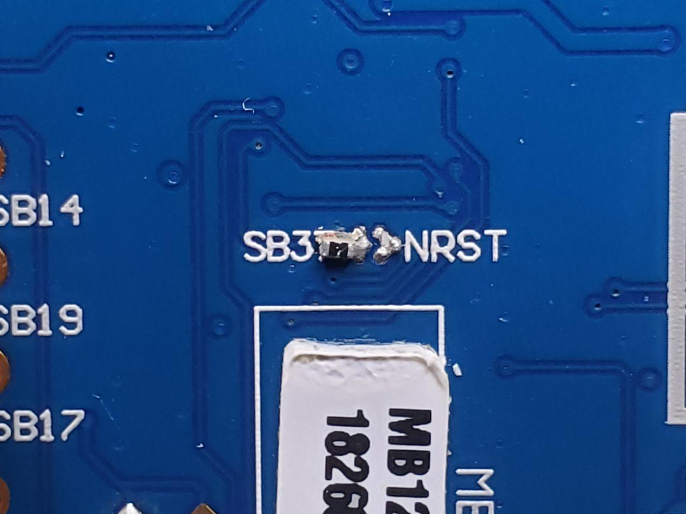
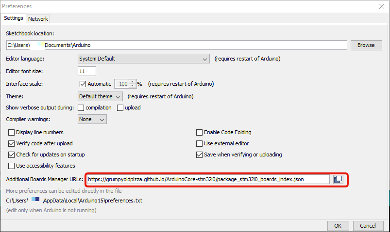
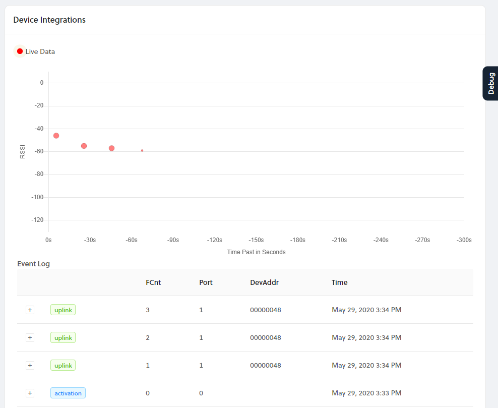

# ST B-L072Z-LRWAN1


## Introduction

This guide will show you step by step how to transmit LoRaWAN packets using a longfi-arduino sketch on an STMicroelectronics B-L072Z-LRWAN1 Discovery kit.


Before we begin, please make sure you've followed the steps from this [guide](https://developer.helium.com/console/quickstart), which goes over some initial setup steps.


## Objective and Requirements

In this guide, you will learn:

* How to setup your environment 
* How to build and program a basic application that will send packets over the Helium Network
* Verify real-time packets sent to the Helium Console via Hotspot that's in range

For this example, you will need the following:

### Hardware

* [STMicroelectronics B-L072Z-LRWAN1 Discovery kit](https://www.st.com/en/evaluation-tools/b-l072z-lrwan1.html)
* Micro USB Type B Cable - [Example](https://www.amazon.com/AmazonBasics-Male-Micro-Cable-Black/dp/B0719H12WD/ref=sr_1_2_sspa?)

### Software

* [Arduino software \(IDE\)](https://www.arduino.cc/en/Main/Software) 
* [Arduino Core for STM32L0](https://github.com/GrumpyOldPizza/ArduinoCore-stm32l0)
* [Helium Console](https://console.helium.com/) 

## Hardware Setup

To start you’ll just need to install the included antenna.

We'll be using the ST-Link debugger on the Discovery board, so you'll want to connect the micro-USB B connector to the micro-USB port labeled `CN7 USB STLINK`.


If you will be running the device using the AAA battery supply, you will need to remove a resistor on the underside of the board. We can just move it over to one of the pads and leave it attached for later. **You don't have to worry about this right now, as we will be powering the board off the MicroUSB connection.** 



### Required Driver \(Windows Only\) <a id="required-driver-windows-only"></a>

Download driver [here](https://www.st.com/en/development-tools/stsw-link009.html).

That’s it for the hardware setup! Next we will setup your environment. 

### Getting the Arduino IDE

Download and install the latest version of [Arduino IDE](https://www.arduino.cc/en/Main/Software) for your preferred OS.

* [Windows](https://www.arduino.cc/en/Guide/Windows)
* [Linux](https://www.arduino.cc/en/Guide/linux)
* [Mac OSX](https://www.arduino.cc/en/Guide/MacOSX)

### STM32L0 Core Support & Libraries

The ST B-L072Z-LRWAN1 requires one package to be installed follow the instructions below.

#### Arduino Core for STM32L0

To install, open your Arduino IDE:

1. Navigate to **\(File &gt; Preferences\)**
2. Find the section at the bottom called **Additional Boards Manager URLs:**



1. Add this URL in the text box:

```text
https://grumpyoldpizza.github.io/ArduinoCore-stm32l0/package_stm32l0_boards_index.json
```

1. Close the Preferences windows

Next, to install this board support package:

1. Navigate to \(**Tools &gt; Boards &gt; Boards Manager...\)**
2. Search for  **Tlera Corp STM32L0 Boards**
3. Select the newest version and click Install

### Programming **Example Sketch** <a id="programming-example-sketch"></a>

Now that we have the required Arduino board support and libraries installed, lets program the board with the provided example sketch.

To create a new Arduino sketch, open your Arduino IDE, \(**File &gt; New\).** Next, replace the template sketch with the sketch found [here](https://raw.githubusercontent.com/helium/longfi-arduino/master/ST-B-L072Z-LRWAN1/longfi-us915/longfi-us915.ino), copy and paste the entirety of it.

Next we'll need to fill in the AppEUI, DevEUI, and AppKey, in the sketch, which you can find on the device details page on Console.  For this sketch you do not need to modify the formatting of the EUIs and Key at all, simply copy and paste them as is. 


At the top of the sketch, replace the three **FILL\_ME\_IN** fields, with the matching field from Console, example shown below.


### Selecting Board

Next, we need to select the correct board to build for in the Arduino IDE. Navigate to \(**Select Tools &gt; Board: &gt; B-L072Z-LRWAN1\).**

### Selecting Port

We're almost ready to upload our sketch, the very last step is to select the correct Serial port in the Arduino IDE. Navigate to \(**Tools &gt; Port: COM\# or /dev/ttyACM\#** **or usbmodem\)** depending on whether you are on Windows, Mac, or Linux. 

### Upload Sketch

We're finally ready to upload our sketch to the board. In the Arduino IDE, click the right arrow button, or navigate to \(**Sketch &gt; Upload\),** to build and upload your new firmware to the board. You should see something similar to the image below at the bottom of your Arduino IDE, when the upload is successful.


### Viewing Serial Output

When your firmware update completes, the board will reset, and begin by joining the network. Let's use the Serial Monitor in the Arduino IDE to view the output from the board.  Navigate to \(**Tools &gt; Serial Monitor**\), you should begin to see output similar to below.


Now let's head back to [Helium Console](https://console.helium.com) and look at our device page, you should see something similar to the screenshot below.



Congratulations! You have just transmitted data on the Helium network! The next step is to learn how to use your device data to build applications, visit our Integrations docs [here](../../console/integrations/).

