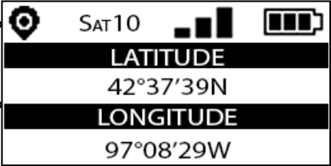
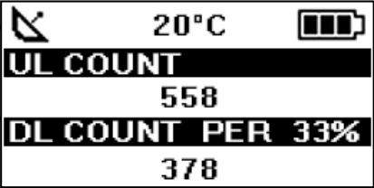
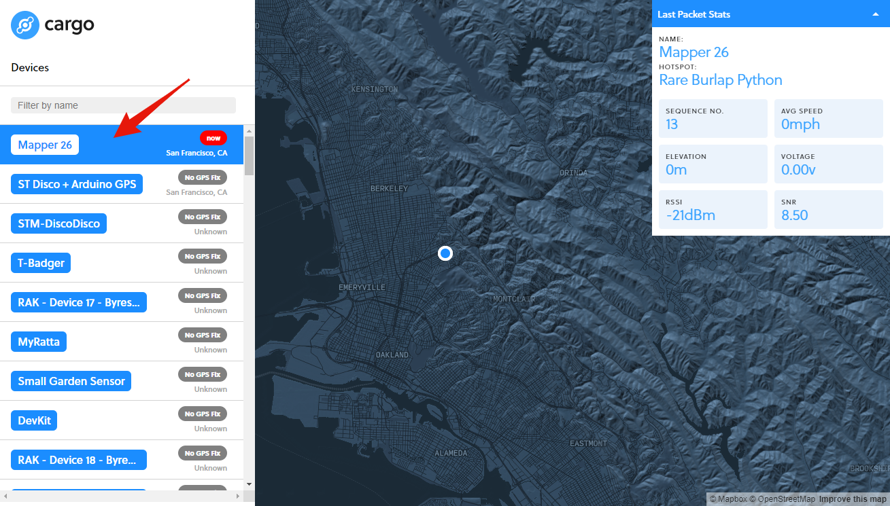
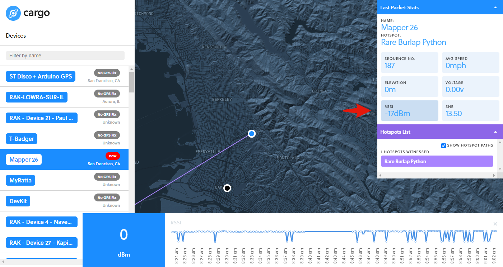

# Coverage Mapping

Helium recently begun an effort to collect device data for the purpose of coverage mapping from voluntary community contributors, you can still apply to participate [here](https://forms.gle/fivp522xsXVUD5mU9). Helium has provided [Adeunis Field Test devices](lorawan-devices/adeunis-field-test-device.md) to applicants across the United States and Canada.  This device was selected initially as it is very simple to operate and provides good feedback on the display. The devices were setup with [this ](https://developer.helium.com/devices/lorawan-devices/adeunis-field-test-device#device-configuration)configuration. 

### Data

All data collected for this effort is publicly available. A full database CSV dump is updated daily for download below. Each hotspot that heard an uplink is referenced by _uplink\_id_ in the hotspots table. A new coverage map will soon be available, allowing you to easily view the contributed data. 

[uplinks.csv](https://coverage-dumps.s3-us-west-2.amazonaws.com/daily-csv-dumps/uplinks.csv)

Database Fields:

```text
id: unique identifier of uplinks
device_uuid: console device uuid
device_name: console device name
dev_eui: device eui
devaddr: device addr
timestamp: time uplink was received
payload: raw payload
fcnt: uplink count
port: uplink port
latitude: device latitude
longitude: device longitude
altitude: device altitude
hdop: GPS accuracy
sat: number of visible satellites
```

[hotspots.csv](https://coverage-dumps.s3-us-west-2.amazonaws.com/daily-csv-dumps/hotspots.csv)

Database Fields:

```text
id: unique identifier of hotspot reception
uplink_id: unique identifier of uplink
hotspot_name: hotspot name
hotspot_id: hotspot public address
latitude: hotspot latitude
longitude: hotspot longitude
rssi: uplink rssi
snr: uplink snr
spreading: uplink spreading
timestamp: time uplink was received
channel: uplink channel
status: uplink status
```

### Mapping Tips

* Only operate at an above ground level of 1-2 meters, otherwise your data will not be representative of most real world devices.
* The device is configured with an uplink interval of five seconds, sufficient for mapping on foot or in a moving vehicle. 

### Mapping Device Instructions

#### Charging

The device is rechargeable via a micro USB connector located on the bottom. It will charge automatically in the ON or OFF state. The device can be used while charging.  Any charger supplying 5V and at least 500mA is sufficient. 


If the battery is completely empty, it will be necessary to recharge the device for 6 hours in order for it to be fully charged.

#### Operating Procedure

Follow all the steps provided below for step-by-step instructions on how to properly operate the field test device.


You must power on the device in a location with coverage in order for the device to first join the network. If the device is not able to join, it will never begin sending uplinks. 


First, power the device On by flipping the switch on the bottom of the device into the ON position.


After you are presented with the start screen, you will see the join screen.


Press _Push Button 2,_ shown below, __once to navigate to the GPS screen, also shown below. If the backlight is off, you will have to press the button twice, once to turn the backlight back on and another time to navigate to the next screen.




Once you have navigated to the GPS screen you'll next be monitoring this screen to validate that the device has a sufficient GPS fix\(enough satellites are visible to accurately calculate its position and time\). Make sure the device is located in a place where a good amount of the sky is visible. Once your device obtains a fix, this may take a few minutes, you will see a latitude and longitude show as well as how many satellites are visible. It's best if six or more satellites are visible. You can now navigate to the Packet Count screen by again pressing the same _Push Button 2_, once if the display backlight is on, and twice if if is off.


Ignore the PER % number as shown in the packet count screen below. This value is not meaningful for the current configuration. Only pay attention to the UL\(Uplink\) Count.




Once you see a positive number in the UL Count field, you have successfully joined the network and are now transmitting packets with location data. At this point you are ready to begin mapping new area, read about how you can view your location live with Helium Cargo below! When you are finished, simply switch the power switch to OFF.

### Viewing on Cargo

When your device is transmitting packets with a valid GPS fix your device will be visible on [cargo.helium.com](https://cargo.helium.com/). The device names are in the format of _Mapper \#_, with the number being that which is displayed on the front of your device with a label as shown below.  The Avg Speed, Elevation, and Voltage will always show zero, as these values were not included.



When you click on your device on the left, you will see a details window pop up in the right top of the window. Here you can click on the _Sequence No_ box shown below to get a time series view of each packet that was received in sequence as well as the Hotspot that received it. The sequence number should match the _UL Count_ on the _Packet Count_ screen shown on the device, although it will likely be a few seconds delayed. The sequence number will start from zero after each power cycle of the device.


You can also click on the _RSSI_ box shown below to view a time series view again, but with the signal strength and Hotspot that received each packet. 




