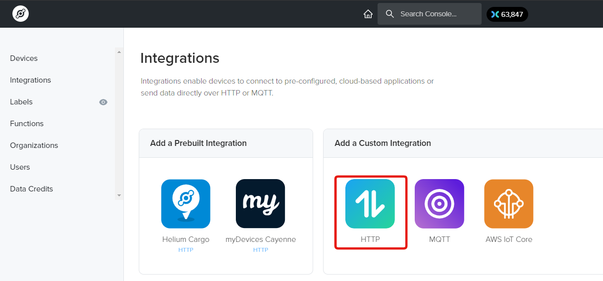
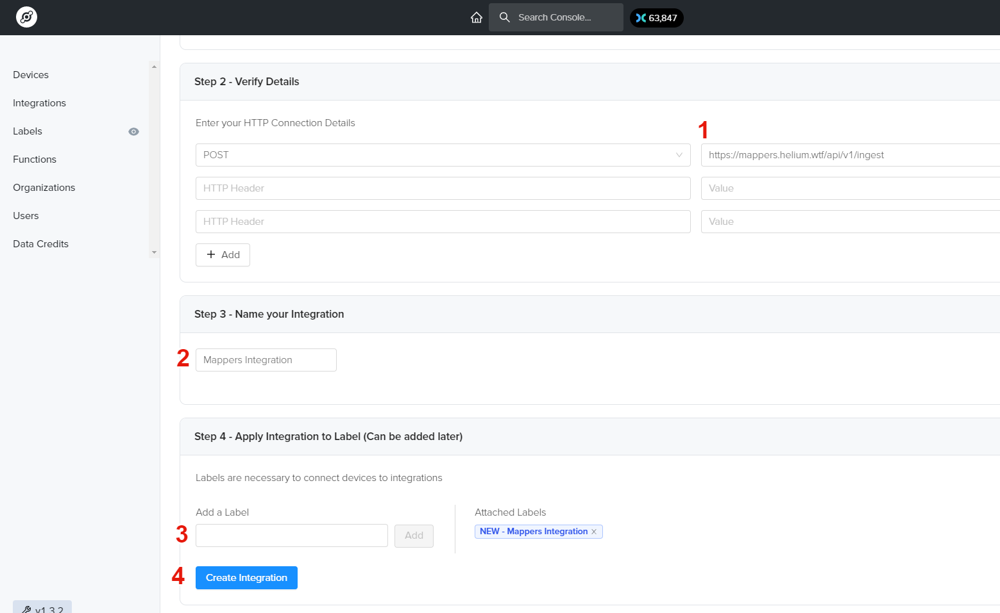
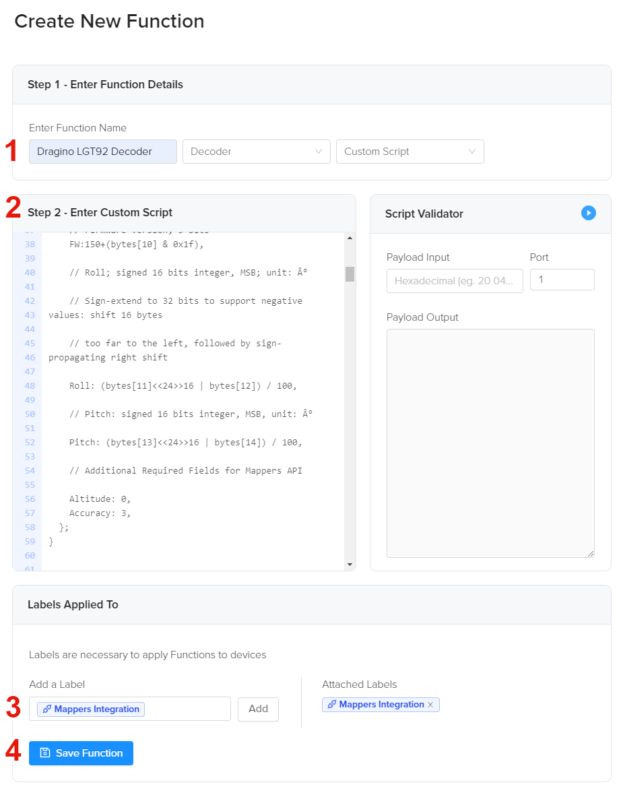
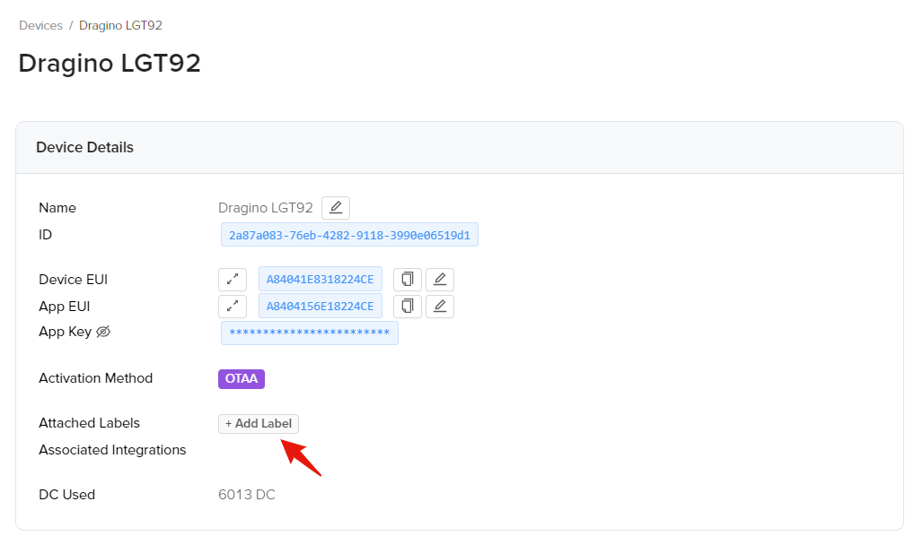
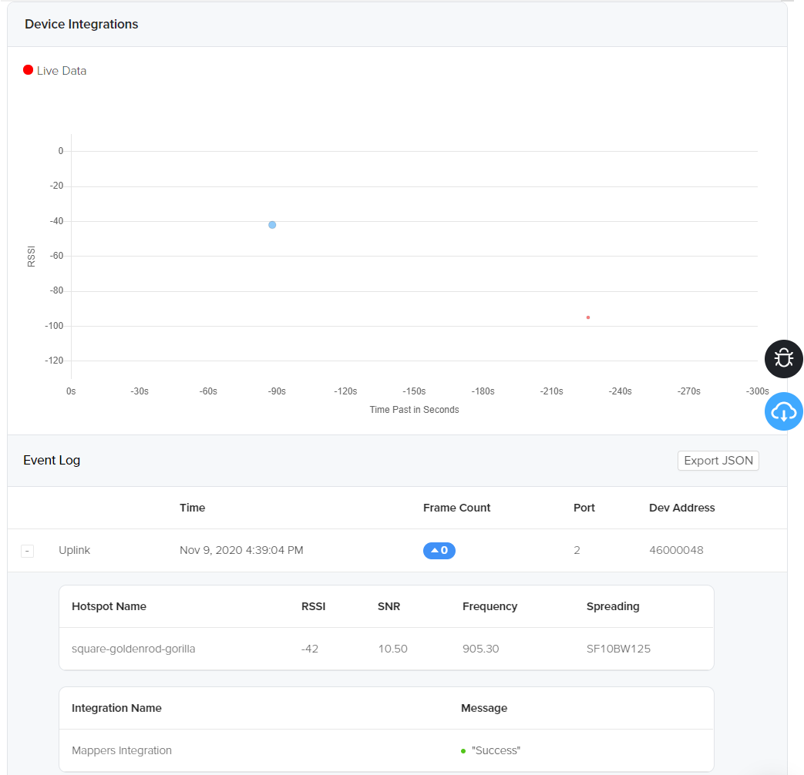

# Mappers Quickstart

This guide will show you step by step how to contribute data to the Mappers project with an off the shelf tracker. This guide will use the [Dragino LGT92](https://www.dragino.com/products/lora/item/142-lgt-92.html), but any LoRaWAN compatible tracker will work.

### Steps

1. Create new Label and HTTP integration with Mappers API ingest endpoint.
2. Create Function Decoder to decode device payload and attach to Label created in first step.
3. Attach Label to tracking device and verify data is being sent successfully.

### 1. Create HTTP Integration

To start, we'll create a new HTTP integration in Console. Navigate to the Integrations page using the left navigation and then select the HTTP integration. 

Next we'll fill in the details, see instructions and image below.

1. Enter the Mappers API Ingest endpoint `https://mappers.helium.wtf/api/v1/ingest`
2. Enter the name for this Integration: _Mappers Integration_
3. Create and apply a Label for this Integration, we've used the same name as the integration.
4. Finally, click _Create Integration_ to complete.

### 2. Create Function Decoder

Next, we'll be creating a Function decoder to decode the payload from the device and properly format it for the API endpoint. The decoder is specific to the encoding scheme used to encode the data before the device transmits it. For off the shelf devices this is usually manufacture specific. For development devices, [CayenneLPP](https://developers.mydevices.com/cayenne/docs/lora/#lora-cayenne-low-power-payload) if often used. For this guide we'll be using a decoder specifically made for this tracking device and slightly modifying it by adding two additional required field. The original decoder can be found from the manufacture's website [here](https://www.dragino.com/downloads/downloads/LGT_92/Decoder/LGT92-v1.5.0_decoder_20191129.txt).

To start, navigate to the Functions page using the left navigation and then click _Create New Function_.

1. Enter a name for the decoder, we've used _Dragino LGT92 Decoder_, select the type of Function, _Decoder_ in this case, and finally select _Custom Script_ from the drop down.
2. Copy and paste the complete decoder function provided by the manufacture found [here](https://www.dragino.com/downloads/downloads/LGT_92/Decoder/LGT92-v1.5.0_decoder_20191129.txt). Next we need to add two more fields that are required by the Mappers API but missing from the function, you'll see these at the bottom of the editor window in the screen shot below. Altitude is permanently set to zero because this device does not output altitude and we will assume that the tracker will be used at ground level. Accuracy is set to three meters since this device does not output a measure of accuracy and this is a reasonable measure of precision to be expected for this device.
3. Next search for and add the _Mappers Integration_ label we created with the integration.
4. Finally save your function.

### 3. Attach Label to Device

Next we'll attach the _Mappers Integration_ label to the device. Navigate to your device page and click the Add Label button shown below.

Search for the _Mappers Integration_ label and click _Add Label_ as shown below.

You are now ready to power on your device and verify that data is being sent correctly to the Mapper API. To do this just expand an uplink event in the event log and verify that you are getting a _"Success"_ message for the integration as shown below.

That's all! You can now expect to see your data show up on [mappers.helium.com](https://mappers.helium.com) in eight hours or less. The map data is updated every eight hours starting at 01:30 UTC.

