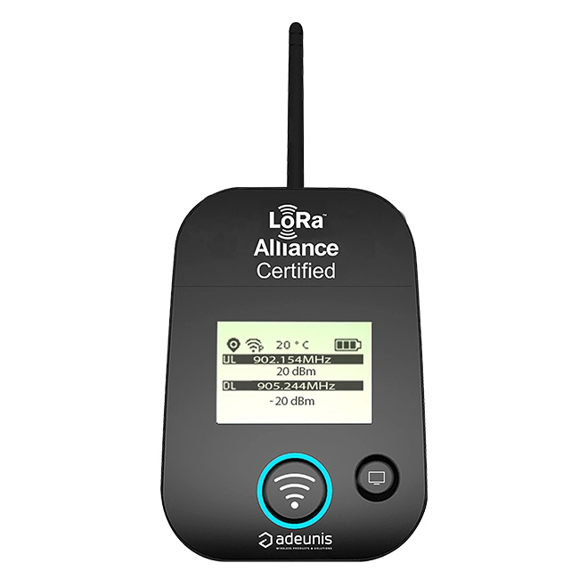
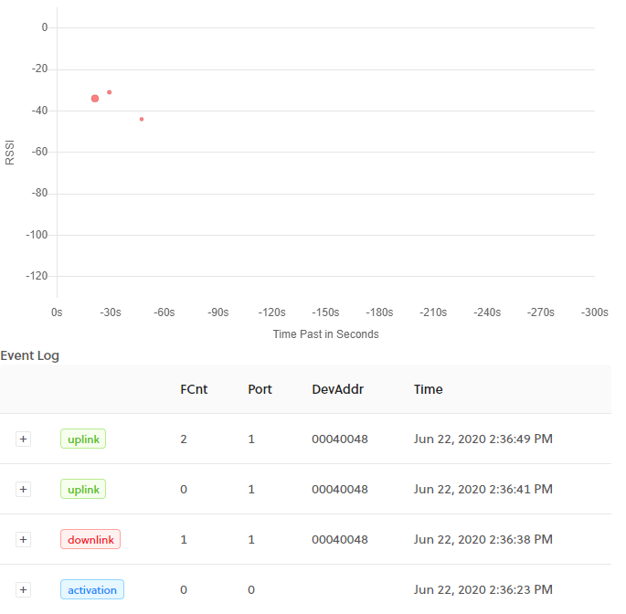

# Adeunis Field Test Device

### Introduction

The Adeunis Field Test Device \(ARF8124A\) is a great tool for network testing. It allows you to rapidly test network coverage at specific geographical positions to verify that devices will have coverage. 

### Resources

[Product Page](https://www.adeunis.com/en/produit/ftd-iot-lorawan-network-tester-915-923/)

[Datasheet](https://www.adeunis.com/wp-content/uploads/2020/02/Data_Sheet_FTD_915-923_EN.pdf)

[Manual](https://www.adeunis.com/wp-content/uploads/2019/12/FTD_LoRaWAN_US902-928_UG_GB_V1.0.0.pdf)

### Add Device to Console

To start, you'll need to add your device to Console. You should have been provided with a DevEUI, AppEUI, and AppKey from the seller of the device.  Follow our [quickstart ](../../console/quickstart.md)for instructions on how to add a new device to Console.

### Device Configuration

The following device configuration changes are required for the device to function properly on the Helium Network. Although the Adeunis IoT Configurator application makes the device configuration much easier, it does not allow you to change all the required settings, so we must use a serial utility. We are using Realterm for our serial utility, but any will work, just be sure to use the correct serial settings and send the commands in the correct format.

[Realterm - Serial Utility](https://sourceforge.net/projects/realterm/)

#### Serial Settings

* Rate 115 200 bps
* Parity None
* Data 8
* Stop Bit 1

#### Activate Command Mode

Only this command requires that you send the command in number form.

Enter Command Mode Command: `0xFF 0xFF 0xFF 0x2B 0x2B 0x2B`

#### Unblock Operating Range

Command: `ATT63 PROVIDER`

This command and all that follow should be sent using the ASCII format with a carriage return\(CR\) at the end.

#### Select Sub band 2

Set Value Command: `ATS259=2`

Read Value Command: `ATS259?`

#### Uplink Unconfirmed

Set Value Command:`ATS382=0`

Read Value Command: `ATS382?`

#### ADR ON

Set Value Command: `ATS220=1`

Read Value Command: `ATS220?`

#### Set Transmission Interval to 5 seconds

Set Value Command: `ATS380=5`

Read Value Command: `ATS380?`

#### Save Configuration

Command: `AT&W`

#### Exit Command View 

Command: `ATO`

You should see the following responses below from the device after entering the above commands.

### Sending Packets

After exiting command mode and on every power on, the device will immediately attempt to join the network. You will the status of the join attempt on the Uplink/Downlink screen, please see the manual for more details on this screen. Once the device has joined press the large push button in the center of the device to send the uplink payload.

