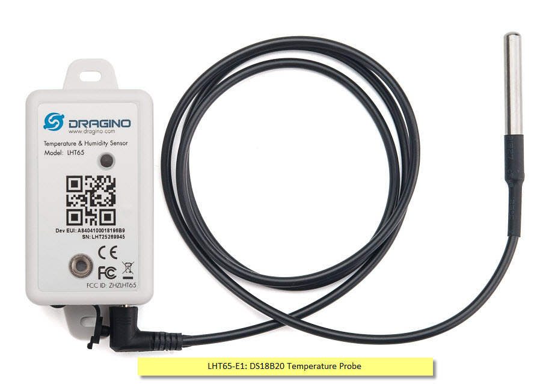
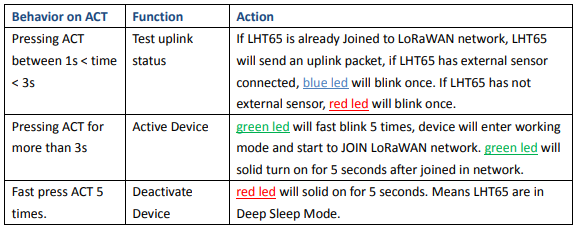
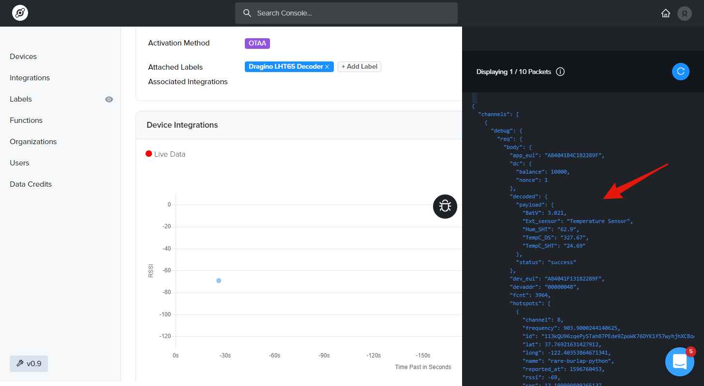

# Dragino LHT65

### Introduction

The Dragino LHT65 is a multi-sensor device which includes a built in temperature and humidity sensor as well as an external sensor connector which supports sensors such as temperature, soil moisture, tilting, and illumination. The device includes a non-chargeable battery that can last for more than 10 years.

### Resources

[Product Page](https://www.dragino.com/products/lora-lorawan-end-node/item/151-lht65.html)

[Datasheet](https://www.dragino.com/downloads/downloads/LHT65/Datasheet_LHT65_LoRaWAN_Temperature_Humidity_Sensor.pdf)

[Manual](https://www.dragino.com/downloads/downloads/LHT65/LHT65_Temperature_Humidity_Sensor_UserManual_v1.7.1.pdf)

### Add Device to Console

To start, you'll need to add your device to Console. You should have been provided with a DevEUI, AppEUI, and AppKey inside the device packaging.  Follow our [quickstart ](../../console/quickstart.md)for instructions on how to add a new device to Console.

### Join Device to Network

Your device will be in a deep sleep mode when you receive it.  To activate the device and place it in a normal operating state, hold down the ACT button for three seconds until you see the LED blink green five times quickly. The operating mode table is shown below for reference.

The device should now begin attempting to join the network. Within a minute or two you should see an activation event on the Console device page as shown below. The device LED will also show solid green for five seconds after it has joined.

Once you have seen event similar to above, your device is now joined to the network and will send its sensor values every ten minutes by default. The transmit frequency and many more settings can be changed, please refer to the manual for instructions.

### myDevices Cayenne

If you would like to easily view your device's data on a web or mobile dashboard for free, this device is supported out of the box by myDevices Cayenne via the integration on Console. You can learn how to quickly setup this integration [here](../../console/integrations/mydevices-cayenne-integration.md).

### Decode Device Payload

When this device transmits its data, it does so in a space efficient manner by packing the bytes of data in a specific way so that no space is wasted, learn more about this in our short primer [here](https://developer.helium.com/console/functions#a-primer-on-encoding-and-decoding). The manufacture of this device, Dragino, is using their own encoding scheme to define which bytes hold which piece of data.  Below is a table taken from the manual showing the size and location of each piece of data.

If you would like to decode the device payload to view it in Console or send to your own application, this section will show you how.  We'll be using a Console Function Decoder to unpack the device payload into a human readable form, you can learn more about Functions in general [here](../../console/functions.md).

#### Create Function Decoder

Lets begin by creating a new custom function decoder. First enter a name, select decoder for function type, and finally custom script since we'll be inputting our own script. Next, remove the template custom script, and copy and paste the entire script found [here ](https://www.dragino.com/downloads/downloads/LHT65/payload_decode/ttn_payload_decode_v1.7.txt)into the script editor. Last, create a label that we'll use to attach this decoder to the device with.

#### Attaching Function Decoder

Next navigate to the device page and attach the label we just created for the function decoder as shown below.

#### Viewing Decoded Device Data

Once you have attached the decoder we can now open the Debug window to view the decoded device payload in the received uplink. You can learn more about the Debug tool [here](../../console/debug.md). To open the Debug window just click on the bug icon on the right side of the device page. Once you have the Debug window open you can wait for the next packet to transmit or force a manual transmission by holding down the ACT button for more then one second and less then three. You'll see the LED turn green while you hold it down and then it should turn red briefly after releasing. You should see the uplink message with the decoded fields as shown below.

