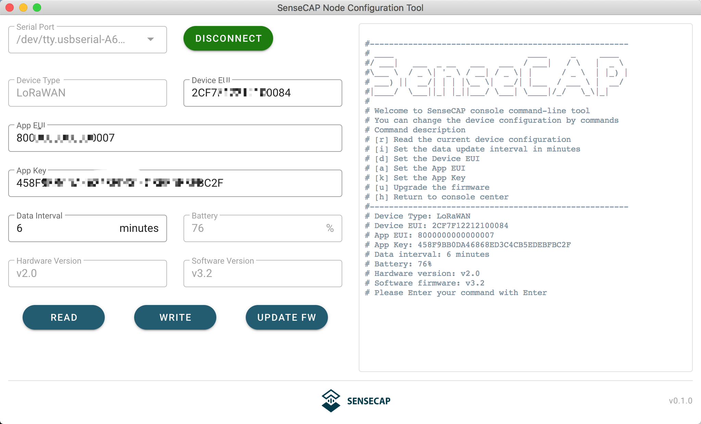

# Seeed SenseCAP

SenseCAP is a series of industrial IoT products. It is based on the LoRaWAN protocol and deployable worldwide with multiple ISM bands. SenseCAP is encapsulated in an IP66 enclosure, making it applicable in outdoor remote sensing scenarios such as Smart Farming, Smart City, and other IoT applications that need low-power, long-distance, and long-term data collection.

| Sensors | Range | Accuracy |
| :--- | :--- | :--- |
| AirTemp&Humi Sensor | -40~90°\(0-100%RH\) | 土0.3°C土2%RH |
| Soil Temp&Humi Sensor | -30~ 70°\(O~ 1 00%RH | 土0.2°c土2%RH \(0%~50%\) |
| Air Pressure Sensor | 300-1100hPa | 士1hPa \(950hPa~ 1 OSOhPa \(0\)° \(-40°c\) |
| CO2 Sensor | 400-10,000ppm | 士30ppm+3% |
| Light Sensor | Max 188,000Lux | 0.045Lux/LSB |
| Wind Speed Sensor | 0-60m/s | 0.125m/s |
| Wind Direction Sensor | 8 Directions | 45° |
| Water PH Sensor |  |  |
| Light quantum Sensor |  |  |
| Electrical Conductivity Sensor |  |  |
| Dissolved Oxygen Sensor |  |  |
| Soil VWC&EC&Temp Sensor |  |  |
| Rainfall Recorder Sensor |  |  |

The Sensor Probes can easily be interchanged between Sensor Node Controllers.

The main SenseCAP module contains the LoRaWAN radio, antenna, and batteries.

To reprogram the SenseCap, you will need an TTL/Serial cable. I added some 90 degree headers on the base unit to make it easier to connect a molex connector, but you may can make do with sliding some pins in there and holding them at an angle to maintain contact.

Only connect the Ground and the TX/RX lines; leave the 3v3 pin disconnected.

At this point, we can either connect to the device directly using a serial terminal, or use the SenseCAP GUI utility \(for Windows and Mac only ATM\) found [here](https://github.com/Seeed-Solution/SenseCAP-Node-Configuration-Tool).

Connect your cable, turn the unit on, and then tap the Reset button while holding the Set button. This will put you into programming mode.

Using this tool, you will first need to upgrade the firmware so that it will be set to use sub-band 7 that allows the node to operate on the Helium Network.



Following that, either jot down your Device EUI/App EUI/App Key from the right pane in the utility and enter those into the Helium Console, or get the Helium keys from the Console, enter them in this utility, and write them down to the node.

Voila!

Unplug your cable, hit the reset button, wait for the red LIVE led to flash a few times, and you should see an activation come across your Helium Console! At this point, carefully replace the sensor cap, and you should be good to go!

