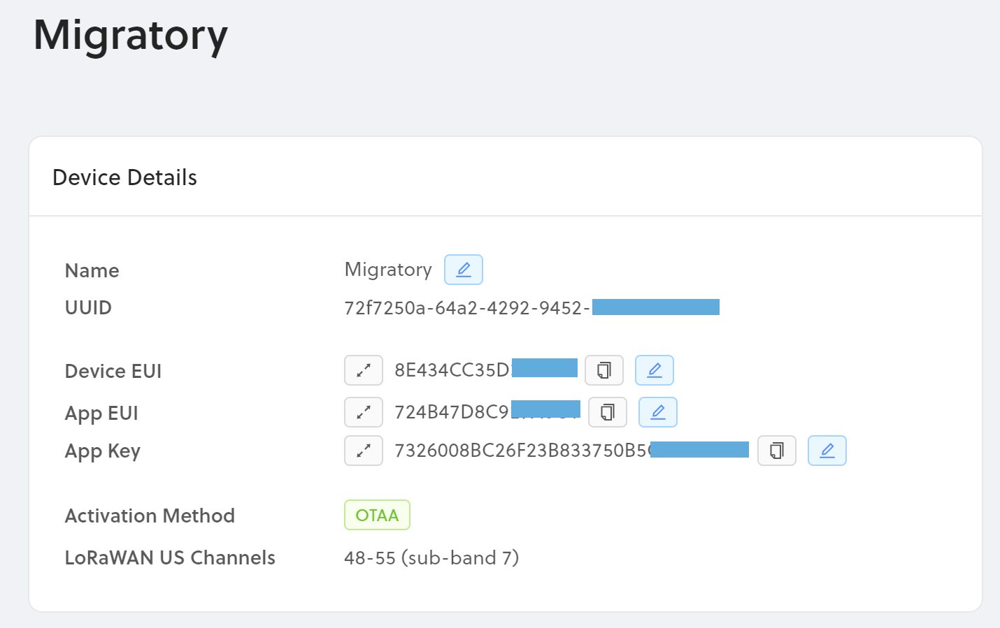

# The Things Network

This short guide will walk you through porting your devices to the Helium Network \(and Helium Console\) from TTN and the TTN Console. If you are doing more than a few devices though, you may want to try the [Command-Line Interface for automated import](https://developer.helium.com/console/cli#ttn-import).

At a high level, there are two steps to accomplish this migration:

1. Copying your keys from the TTN Console to the Helium Console. \(Right now this is a manual process, but we'll soon have a CLI that automates this\).
2. Porting your `application`logic from TTN Console to use the far superior `labels` construct in the Helium Console.

## Copying Keys and Ensuring you're using Sub Band 2

In the [TTN Console](https://console.thethingsnetwork.org/), we go to the [Application](https://console.thethingsnetwork.org/applications) containing the device we want to migrate and copy these keys over into a new Device created in [Helium Console](https://console.helium.com).

Next, you need to ensure the device can use LoRaWAN US channels `8-15` \(also known as `Sub-band 2`\). This process can vary by device. Some come bundled with configuration utilities, others you will have to recompile and flash the firmware yourself. It is also possible that the network negotiates the sub-channel band itself.

The full frequency table for the US915 band is found [here](../../longfi/regional-channels.md) but comparison is available below. 

By default, LoRaWAN compliant end nodes should use all channels \(0-63\) for the OTAA join process. After OTAA Joined, the first uplink packet on sub-band 2 will receive a downlink response with an ADR command with the appropriate channel mask; thereafter, the end node should use these channels \(8-15\) to send uplink packets.

### Comparison \(MHz\):

| **TTN Frequency** | **Helium Frequency** | **SFBW** |
| :--- | :--- | :--- |
| 903.9 | **903.9** | SF7BW125 to SF10BW125 |
| 904.1 | **904.1** | SF7BW125 to SF10BW125 |
| 904.3 | **904.3** | SF7BW125 to SF10BW125 |
| 904.5 | **904.5** | SF7BW125 to SF10BW125 |
| 904.7 | **904.7** | SF7BW125 to SF10BW125 |
| 904.9 | **904.9** | SF7BW125 to SF10BW125 |
| 905.1 | **905.1** | SF7BW125 to SF10BW125 |
| 905.3 | **905.3** | SF7BW125 to SF10BW125 |
| 904.6 | **904.6** | SF8BW500 |

## Porting Your Application Logic to use Helium's Labels Construct

After you've added your device to the Helium Console, you'll likely need to reconstruct the [Application](https://www.thethingsnetwork.org/docs/applications/) you've built for your devices in TTN's Console.

Instead of an `application`, Helium uses [labels](device-migration-the-things-network.md), and instead of creating your TTN application first, then adding devices to it, Helium lets you add any number of devices to Console, then group them by labels after the fact. Devices can also have more than one label.

To read more about Labels and how you should use them to replace and extend `applications`, head [here](device-migration-the-things-network.md).

