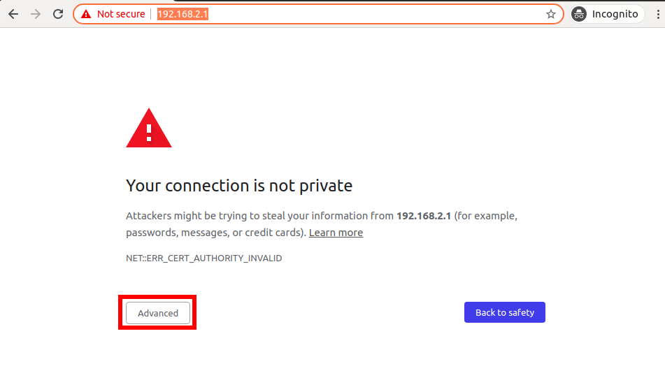
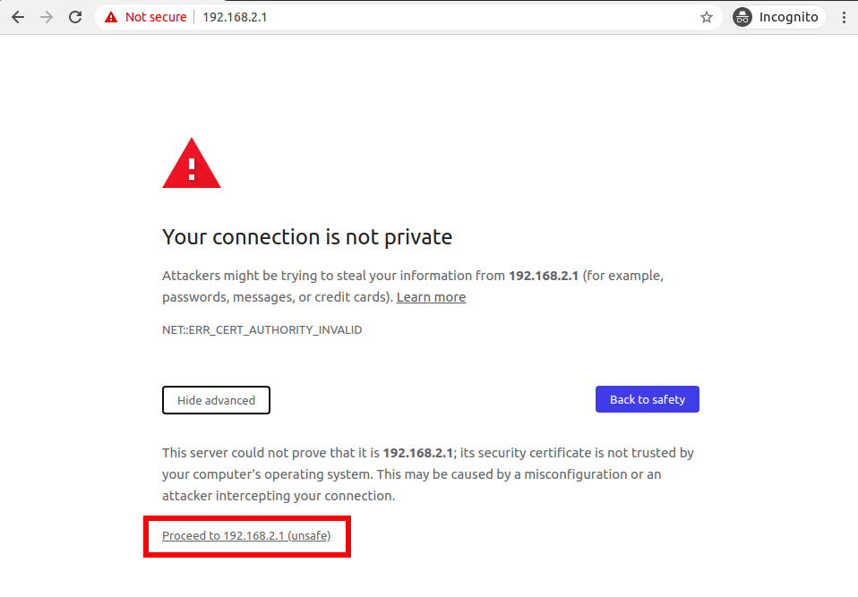
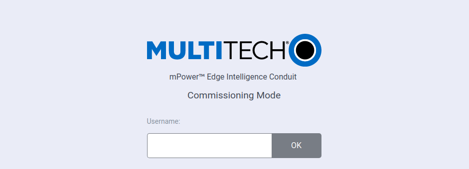
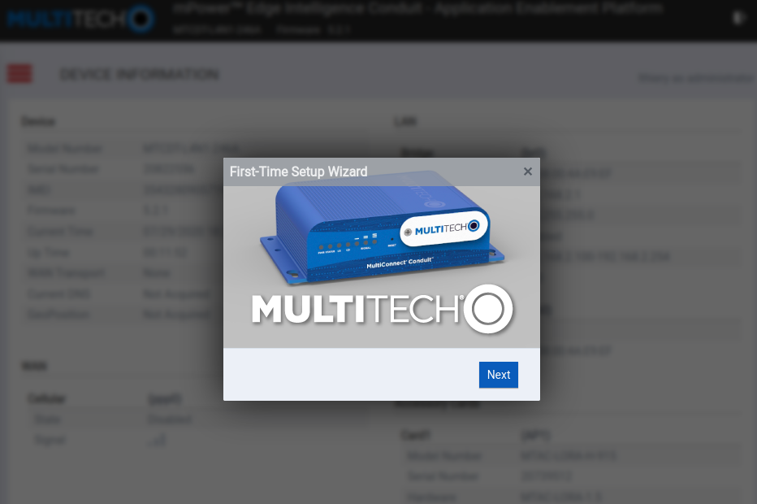
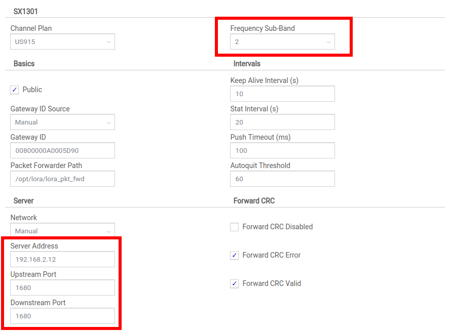
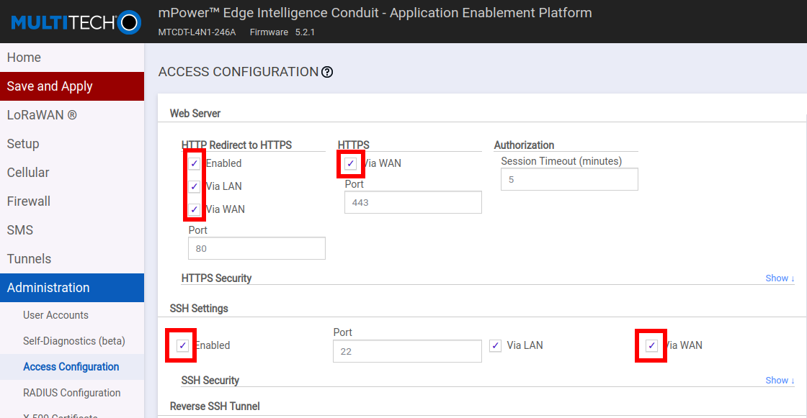

# Multitech Conduit



Non-Helium manufactured LoRaWAN gateways are not yet able to mine Helium tokens.  This will be supported soon.


The MultiTech Conduit features cellular backhaul and a robust aluminum casing. In addition to an Ethernet port and the remote DeviceHQ management tool, it's a popular solution for indoor industrial deployments.

## Prerequisites

#### Deploy Helium Cloud Miner

Using the MultiTech Conduit on the Helium Network requires a running the blockchain miner in the cloud. [If you haven't already, get this deployed before moving on. ](../../blockchain/run-your-own-miner.md)

#### Laptop or Desktop with Ethernet Port

The MultiTech Conduit defaults to a DHCP Host, so a machine that can connect to it and complete the configuration is required.

During this tutorial, we will reconfigure the Multitech Conduit as a DHCP client; this will allow it to join your network and be accessible over Ethernet. You can skip those steps if you are happy to rely on the cellular backhaul and prefer to continue connecting directly over Ethernet between your laptop/desktop and the Conduit.

##  **1 - Connect to Conduit as DHCP Host**

By default, the MultiTech is configured as a DHCP Host. 

This is very similar to your standard WiFi Router in that it is now waiting for you to connect to it via Ethernet where you will join its network and be assigned an IP.

In your favorite browser,  type the default IP address `192.168.2.1`. You will be me with a privacy warning and most browsers require you to click something like "Advanced" to proceed:



Only then, will you then be provided with an option of proceeding:



After proceeding, you will be greeted with the MultiTech commissioning screen!

##  2 **- Commissioning**



The next series of screens will assist you in configuring a secure username and password for your Conduit.

##  3 **- Setup Wizard**



Since it's your first login, you are prompted with a setup wizard. Feel free to use the Wizard, in particular if you want to use the DeviceHQ remote management service. We will skip that in this tutorial though and you can feel free to "X" out of the Wizard.

## 

##  4 **- LoRaWAN Configuration**

On the left menu, click LoRaWAN. On this configuration page, you will first want to set the mode to "PACKET FORWARDER"


Then you will want to configure the appropriate sub-band \(2\) and the Network Server of your Miner. If you need to setup a Miner, please follow [our tutorial here](../../blockchain/run-your-own-miner.md).



Click "Save and Apply" in the top left to save this LoRaWAN configuration.

##  5 **- Access Configuration**

If you are interested in having the Conduit use Ethernet as an option for Internet, you'll want to reconfigure it as a DHCP Client. Before doing that though, we need to update the "Access Configuration" so that you can maintain access to the browser GUI that we are using.

Click on the `Adminstration -> Access Configuration` tab on the left and tick all the boxes indicated here:



Note that we've enabled SSH here. You could skip that, but its a nice option to have.

Be sure to click "Save and Apply" before proceeding!

##  6 **- Configure as DHCP Client**

To get Internet over the Ethernet port on most networks, the easiest way is to configure the MultiTech Conduit as a DHCP Client. 

Go to `Setup -> Network Interfaces`and change the IPv4 Mode to "DHCP Client".


You'll get a warning in an orange box in the top right about potentially losing access to the browser GUI by doing this. The previous step will prevent this from happening. Double check that you hit "Save and Apply" during the previous step.

Click "Save and Apply"; this will cause a full reboot and you'll lose access to the GUI. In order to connect again, you'll need to use a network scanning tool to figure out what IP the conduit was given on your network. 

You'll only need that if you want to reconfigure the device in the future. And if you something went wrong here, you can always hold the "RESET" button for 30 seconds \(until the middle light goes solid green\) to restore factory settings and start from Step 1 again.

## 7 **- Verification**

Upon connection of a packet forwarder and a Miner, you should start seeing Semtech UDP frames appearing in the Miner logs.

For example, if your Miner is running in a docker container called `miner`, you can run the following command:

```text
docker exec miner tail -F /var/log/miner/console.log | grep lora
```

Every 10 seconds or so, you should see a `PULL_RESP` heartbeat from the forwarder to the Miner. If that is not happening, double check the IP address configured above in "Update Server Configuration". If that looks okay, make sure that UDP port on the Miner is open. On cloud services such as AWS, you'll need to open up ports as described [in the tutorial](../../blockchain/run-your-own-miner.md).

