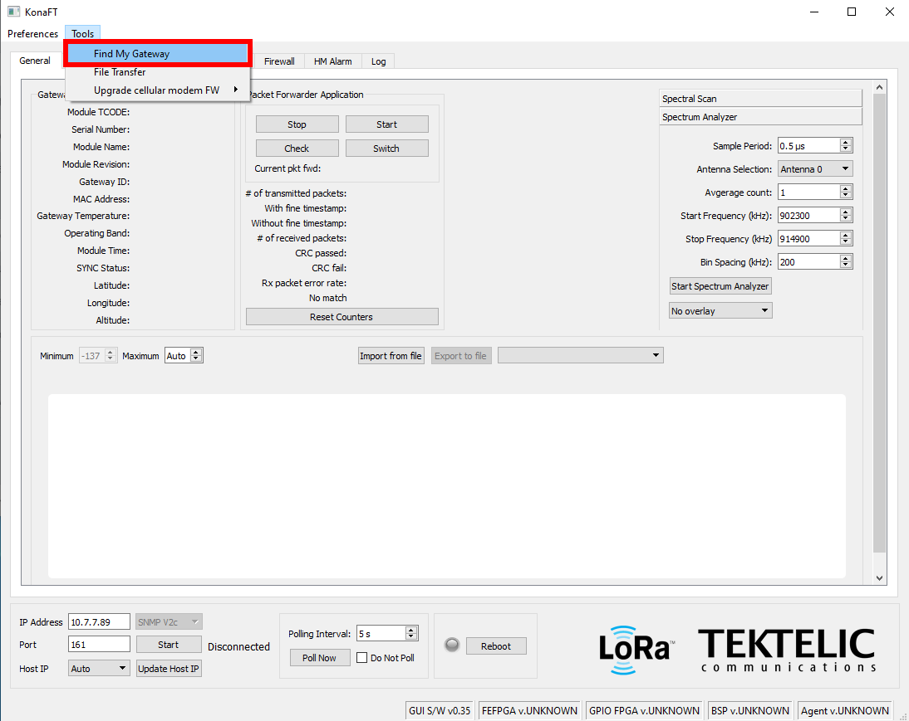
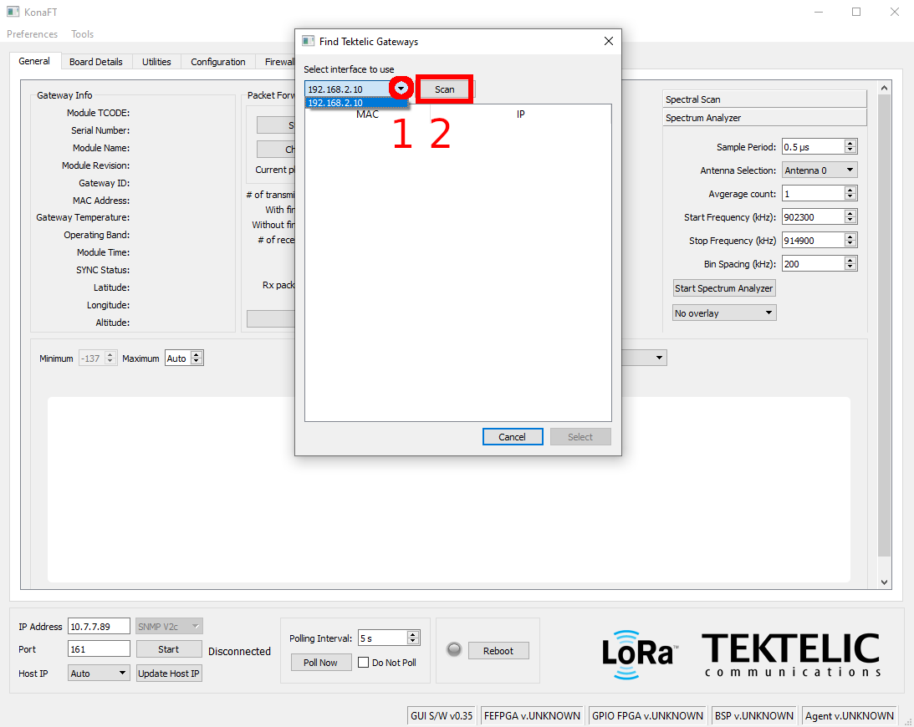
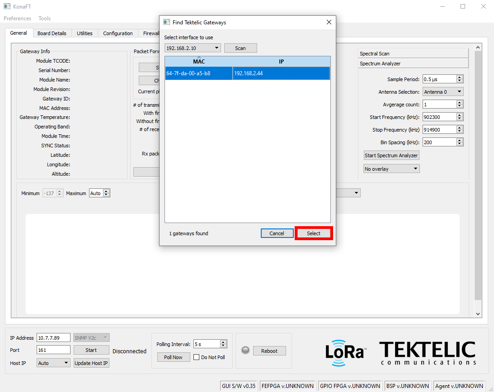
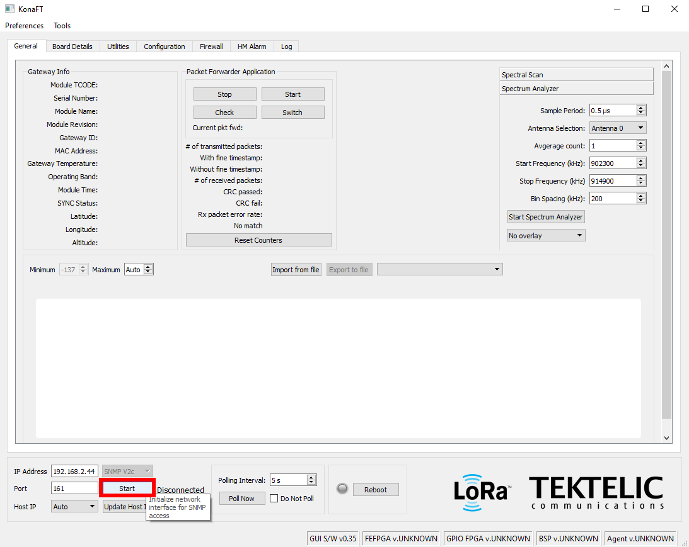
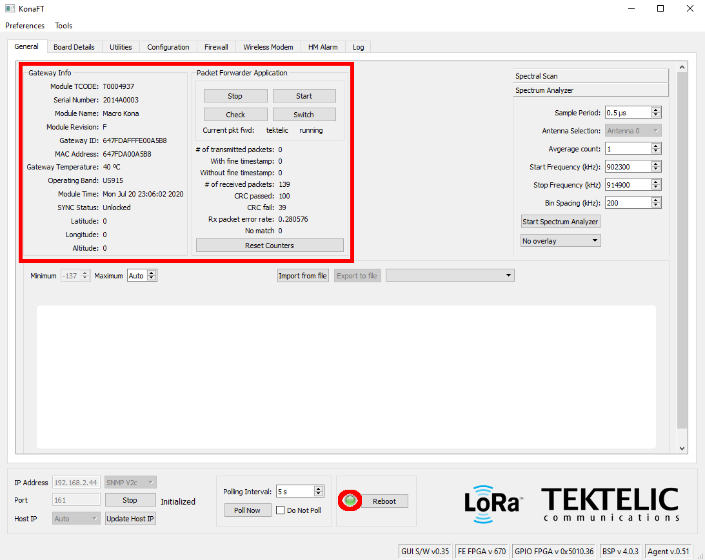
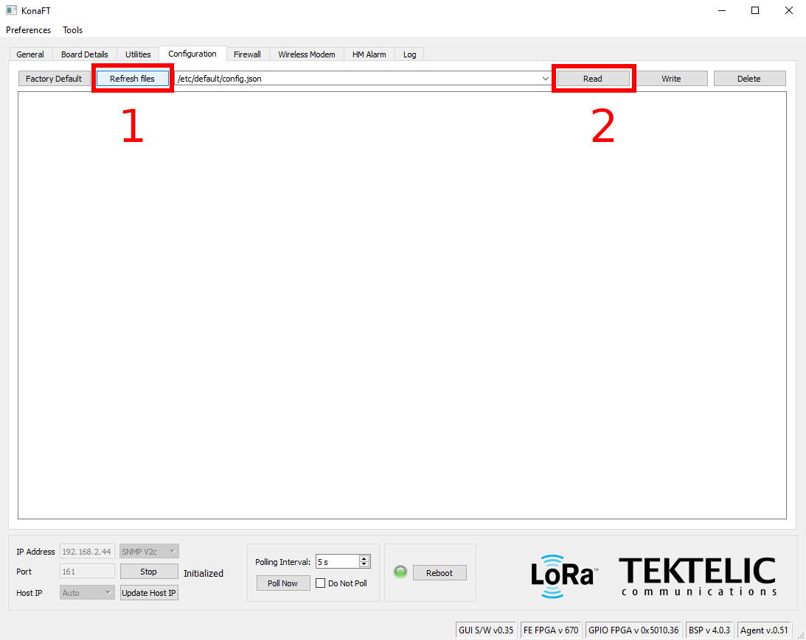
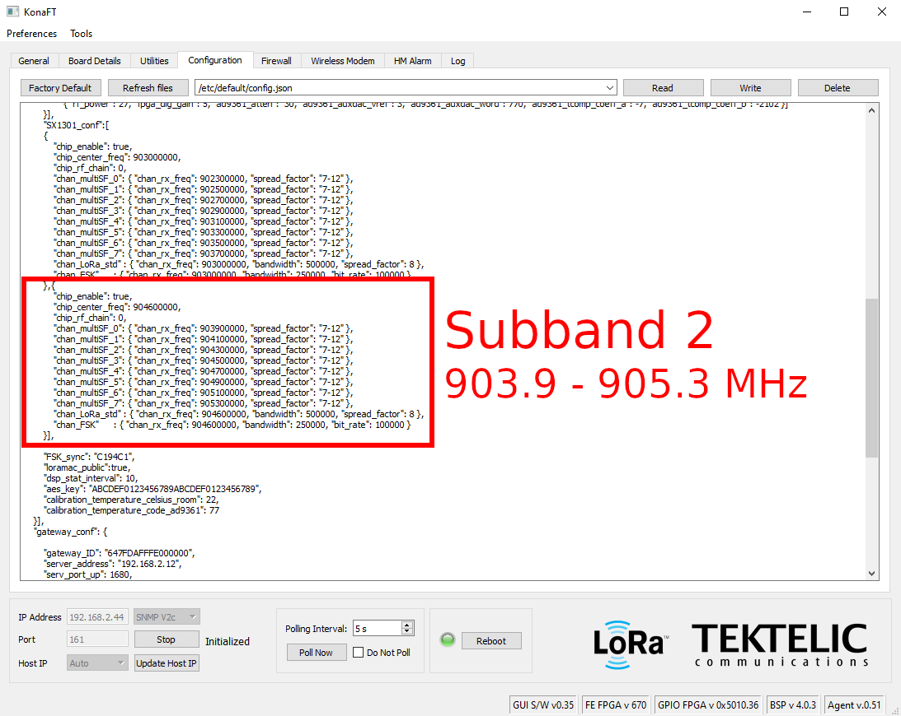

# Tektelic KONA



The ability to mine HNT with a 3rd party gateway is currently under development following the conclusion of the DIY Alpha program. Please join the [Helium Discord Server](https://discord.gg/helium) and the \#hotspot-diy-hardware channel for the latest updates on the roadmap and expected timelines.


Tektelic features [a robust catalogue of LoRaWAN gateways](https://tektelic.com/iot/lorawan-gateways/) suitable for various deployments requirements. Their ruggedized gateways with Cellular backhaul are becoming particularly popular for Helium Network deployments where coverage needs to be deployed outdoors, where Ethernet or WiFi infrastructure cannot be relied on for communicating with the Internet.

## Prerequisites

#### Deploy Helium Cloud Miner

Using the Tektelic KONA on the Helium Network requires a running the blockchain miner in the cloud. [If you haven't already, get this deployed before moving on. ](../../blockchain/run-your-own-miner.md)

#### Download KonaFT Utility

All of the Tektelic gateways have a similar setup process and options. In this guide, we'll get you up and running using the [KonaFT utility](https://support.tektelic.com/portal/en/kb/articles/konaft) \(for Windows only\). Once you have downloaded and installed the utility, you can follow along with this guide.

Before starting, you'll want to connect the gateway via Ethernet to the network where your desktop or laptop is connected. 

## **1 - Find My Gateway**

Select `Tools -> Find My Gateway`



## **2 - Select Network Interface**

**Step 1**: Click the down arrow in the new window that has appeared and select the appropriate network interface. Usually it's the one starting with `192.168.1` or `192.168.2`.

**Step 2**: Click Scan to scan on that network interface. This can take a few minutes but a progress bar will let you know everything is working.



## **3 - Select Gateway**

Once the scan completes, your gateway should have been found. Click Select to point the main screen to this gateway.



## **4 - Connect to Gateway**

You'll see in the bottom left the IP of the gateway that you selected on the previous step. Just click "Start" to connect to the gateway.



Upon successful connection, you'll notice that fields in the top left have been populated.



And that a flashing green light icon has appear in the center bottom.

## **5 - Read Configuration**

Click the "Configuration" tab on top. From that tab:

**Step 1**: Click `Refresh Files`. The path `/etc/default/config.json` should appear. Click `Read`.



## **6 -** Update Sub-band

Scroll down until you see the JSON field `"SX1301_conf"`. Generally, sub-band 2 is already there \(ie: channels from 903.9 to 905.3 MHz\).  



If not, you can paste this configuration to one of the singular or one of the configuration arrays \(some Tektelic gateways support multiple sub-bands\):

```text
{
   "chip_enable": true,
   "chip_center_freq": 903000000,
   "chip_rf_chain": 0,
   "chan_multiSF_0": { "chan_rx_freq": 902300000, "spread_factor": "7-12" },
   "chan_multiSF_1": { "chan_rx_freq": 902500000, "spread_factor": "7-12" },
   "chan_multiSF_2": { "chan_rx_freq": 902700000, "spread_factor": "7-12" },
   "chan_multiSF_3": { "chan_rx_freq": 902900000, "spread_factor": "7-12" },
   "chan_multiSF_4": { "chan_rx_freq": 903100000, "spread_factor": "7-12" },
   "chan_multiSF_5": { "chan_rx_freq": 903300000, "spread_factor": "7-12" },
   "chan_multiSF_6": { "chan_rx_freq": 903500000, "spread_factor": "7-12" },
   "chan_multiSF_7": { "chan_rx_freq": 903700000, "spread_factor": "7-12" },
   "chan_LoRa_std" : { "chan_rx_freq": 903000000, "bandwidth": 500000, "spread_factor": 8 },
   "chan_FSK"      : { "chan_rx_freq": 903000000, "bandwidth": 250000, "bit_rate": 100000 }
}
```

## **7 -** Update Server Configuration

**Step 1**: Scroll further down until you find the JSON field `"gateway_conf"`. You'll want to put the IP address and the radio UDP port interface \(default `1680`\) of your Miner. If you need to setup a Miner, please follow [our tutorial here](../../blockchain/run-your-own-miner.md).

**Step 2:** Click `Write` to write the sub-band and server configurations to the file.

**Step 3**: Click `Reboot` to restart the gateway and thus the packet forwarder; upon boot it will be forwarding to your Miner!


## **8 -** Verification

Upon connection of a packet forwarder and a Miner, you should start seeing Semtech UDP frames appearing in the Miner logs.

For example, if your Miner is running in a docker container called `miner`, you can run the following command:

```text
docker exec miner tail -F /var/log/miner/console.log | grep lora
```

Every 10 seconds or so, you should see a `PULL_RESP` heartbeat from the forwarder to the Miner. If that is not happening, double check the IP address configured above in "Update Server Configuration". If that looks okay, make sure that UDP port on the Miner is open. On cloud services such as AWS, you'll need to open up ports as described [in the tutorial](../../blockchain/run-your-own-miner.md).

