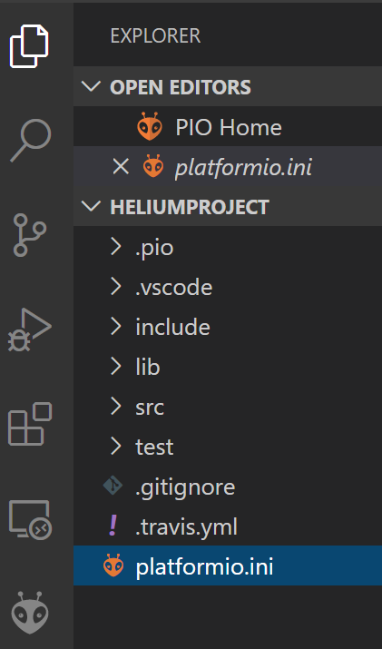
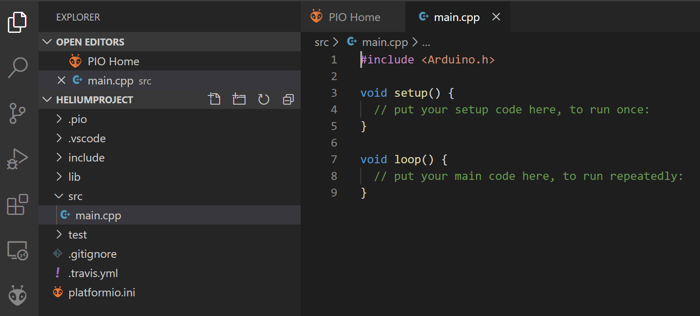
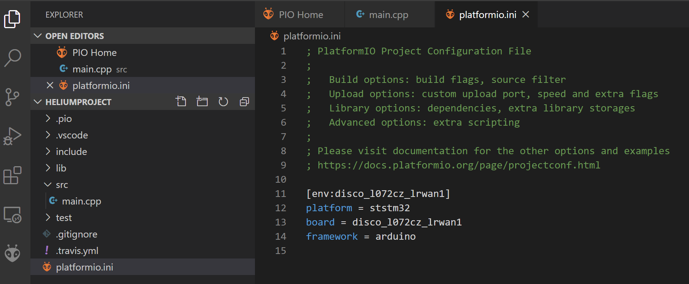
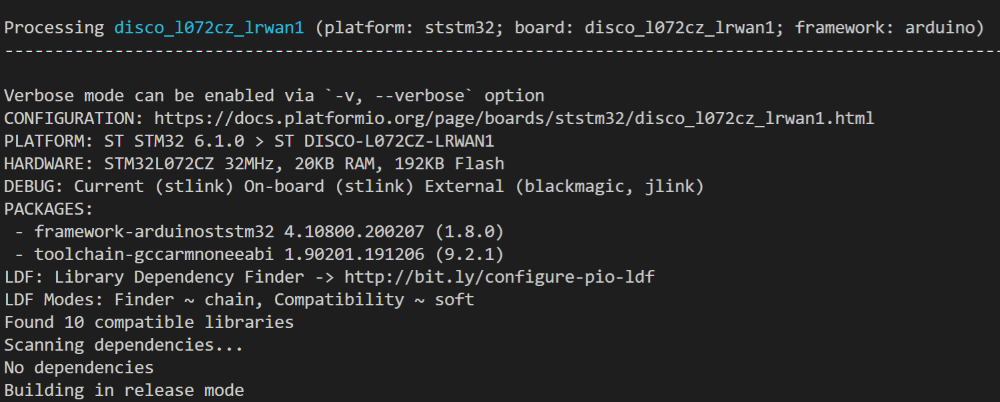
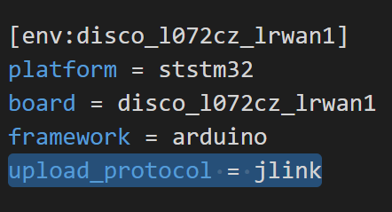

# Getting started with Helium and PlatformIO


### PlatformIO - An Easier Way to Develop Embedded Applications 

[PlatformIO ](https://platformio.org/)is a cross-platform, cross-architecture, multiple framework, professional tool for embedded systems engineers and for software developers who write applications for embedded products.

[PlatformIO ](https://platformio.org/)provides developers with a modern integrated development environment \([Cloud & Desktop IDE](https://docs.platformio.org/en/latest/integration/ide/index.html#ide)\) that works cross-platform, supports many different software development kits \(SDKs\) or [Frameworks](https://docs.platformio.org/en/latest/frameworks/index.html#frameworks), and includes sophisticated debugging \([PIO Unified Debugger](https://docs.platformio.org/en/latest/plus/debugging.html#piodebug)\), unit testing \([PIO Unit Testing](https://docs.platformio.org/en/latest/plus/unit-testing.html#unit-testing)\), automated code analysis \([PIO Check](https://docs.platformio.org/en/latest/plus/pio-check.html#piocheck)\), and remote management \([PIO Remote](https://docs.platformio.org/en/latest/plus/pio-remote.html#pioremote)\). It is architected to maximize flexibility and choice by developers, who can use either graphical or command line editors \([PlatformIO Core \(CLI\)](https://docs.platformio.org/en/latest/core/index.html#piocore)\), or both.

If you are used to developing using the Arduino IDE but constantly feel constrained by the environment, you are going to love what [PlatformIO ](https://platformio.org/)opens up for you.


This guide will walk through installing PlatformIO and deploying a Helium Arduino program on the [ST Discovery Development Kit](../devices/devkit.md). Let's do it. 

### Installing PlatformIO

[Download ](https://code.visualstudio.com/)and install Microsoft's Visual Studio Code, PlatformIO IDE is built on top of it.



1. Open VSCode Extension Manager
2. Search for official PlatformIO IDE extension
3. Install PlatformIO IDE. \([https://marketplace.visualstudio.com/items?itemName=platformio.platformio-ide](https://marketplace.visualstudio.com/items?itemName=platformio.platformio-ide)\)


It is highly recommended to give the quick-start guide a read. It will help you navigate the new interface. [https://docs.platformio.org/en/latest/integration/ide/vscode.html\#quick-start](https://docs.platformio.org/en/latest/integration/ide/vscode.html#quick-start)

In this tutorial, I will be using the [Helium Developer Kit](https://developer.helium.com/devices/devkit).


Once PlatformIO is installed, you should be welcomed to VSCode with the following "PIO Home" screen:


### Starting a new PlatformIO Project

Let's click on "New Project" to get started.

Enter a project name and select the following board:


We will be using the Arduino Framework, so go ahead and click "Finish".

This may take a bit on the first run, but you should soon be left with a project that looks as such:



If we look into `src/main.cpp`, we see the familiar empty Arduino sketch structure:



Let's take a second here to look at the `platformio.ini` file in the root of our new project:



Notice that we specify the environment that we are going to be developing in using the following variables:

* platform
* board
* framework

At this point, you may click the **PlatformIO Build** checkbox in the status bar, and the project will build \(just don't expect it to do anything yet\):


You may notice something unexpected here \(but very cool, and we will get into that here in just a bit\):




Above, PlatformIO "knew" what platform we were building on and installed what was necessary. This will come in handy, as we can add libraries into our **`platformio.ini`** file, and they will be added in at build time.

If, on the **PIO Home** page, you select the "Devices" icon on the left, you will see the physical devices that are connected to your development machine, and what ports they are connected to:


 Notice that under **Description**, it says we are running "JLink" rather than "ST-Link". If we were to attempt to flash the board at this point, we would get a failure that looked like this:

```text
Configuring upload protocol...
AVAILABLE: blackmagic, jlink, mbed, stlink
CURRENT: upload_protocol = stlink
Uploading .pio\build\disco_l072cz_lrwan1\firmware.elf
xPack OpenOCD, 64-bit Open On-Chip Debugger 0.10.0+dev (2019-07-17-11:28)
Licensed under GNU GPL v2
For bug reports, read
        http://openocd.org/doc/doxygen/bugs.html
debug_level: 1

srst_only separate srst_nogate srst_open_drain connect_deassert_srst

Error: open failed
in procedure 'program'
** OpenOCD init failed **
shutdown command invoked

*** [upload] Error 1
===================================================================================== [FAILED] Took 16.63 seconds =====================================================================================
The terminal process terminated with exit code: 1

```

What happened here? Well, we have this board set up to use a `SEGGER JTAG` interface rather than the `ST-Link` interface that is integrated into the Discovery board. There are a number of advantages of this approach, and I would _highly_ suggest doing this. It will make your development iteration process much faster.

Luckily, `SEGGER` has provided a method to \(non-destructively\) replace the ST-Link on our board with a JTAG interface.


[Head here](https://www.segger.com/products/debug-probes/j-link/models/other-j-links/st-link-on-board/) to walk through the simple process. 

We then need to add one additional line to our `platformio.ini` file to let PlatformIO know that we will be using a JTAG interface to our board \(written as `jlink` in your file\):



The next time we build and attempt to upload our project, we will be presented with the following Terms of Use:


Accept this agreement, and you should see the following popup:


And there you have it. At this point, we have successfully programmed an empty sketch onto our Helium Developer Kit using PlatformIO! Go forth and build magical things. 


